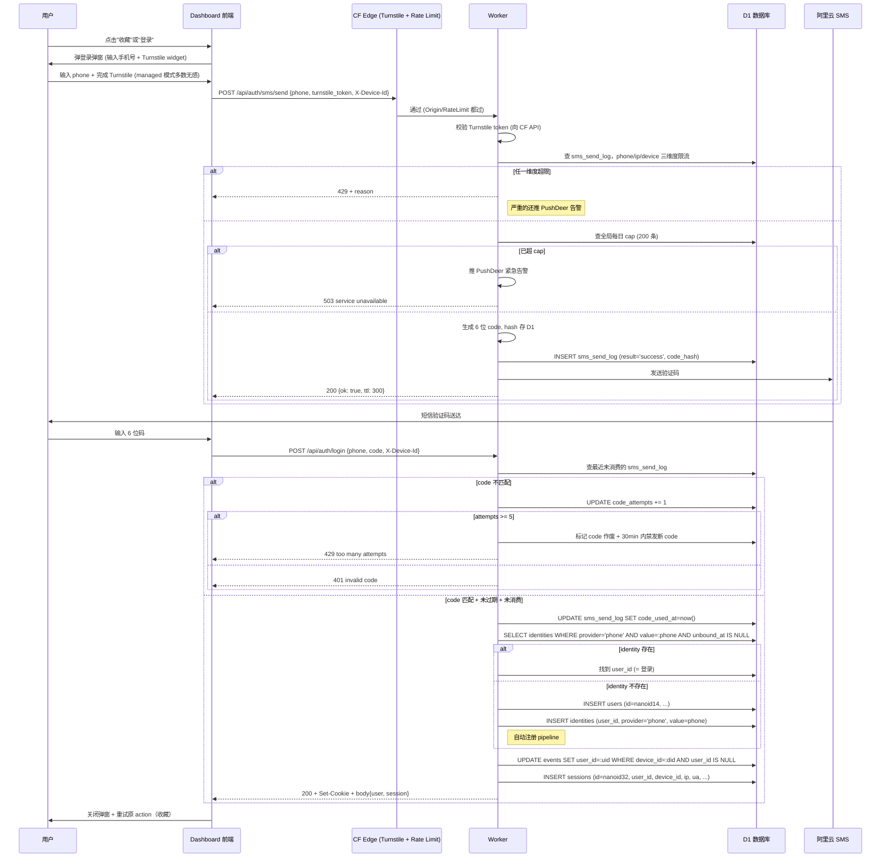

# 账号系统设计 — xList Scraper / ai-feeds

> 背景日期：2026-05-01
> 状态：draft（brainstorm 完毕，等正式实施前再过一遍）
> 设计前置背景：见 TODO.md 中的"前置 2: 账号 + 登录系统"，本文档替代 TODO 里的 oneliner，是该项的完整方案。

---

## 1. 背景与边界

### 1.1 当前现状

- D1 schema 完全没有 user/auth/events 相关表，只有内容侧（`items / sources / run_stats / enrich_state / metrics_snapshots / refresh_log`）。
- Worker 唯一鉴权机制是 `INGEST_TOKEN`（本地 push 数据用），外部 API（`/api/items` / `/api/items/:id` / `/api/sources` / `/api/stats`）全部匿名只读。
- Dashboard（`https://ai-feeds.com`）零登录态，完全前端静态。
- 域名：API 在 `api.ai-feeds.com`，前端在 `ai-feeds.com`，**未做 ICP 备案**（CF 边缘节点跑通）。

→ 账号系统是从 0 起步，**没有历史包袱要兼容**。

### 1.2 为什么做（核心驱动力）

四个维度都有，按重要性排：

1. **个人态功能**（B 维度，user_id 硬需求）：收藏、订阅、跨设备同步个人偏好。
2. **行为追踪 / 回流分析**（A 维度，匿名 device_id 即可）：分享回流统计、漏斗分析。
3. **商业化储备**（D 维度）：未来付费、广告归因。
4. **法规合规**（C 维度）：手机号是国内身份锚点的事实标准（虽非 100% 法规硬要求，但备案/合规惯例）。

### 1.3 主体策略

- **暂时按个人身份推进登录注册模块**：阿里云 SMS、Worker / CF 资源、Turnstile、PushDeer 等都走个人主体
- **企业主体接入后置**：未来再考虑微信 OAuth、一键登录、第三方登录、ICP 企业备案等需要企业资质的能力
- **schema 兼容**：identities 表预留 wechat_openid / unionid 字段（见 3.2），主体切换时无需数据迁移
- ICP 备案短期不做（CF 边缘节点能跑通），未来如有需要再走个人备案

### 1.4 设计哲学

- **登录是 action-triggered**：浏览不强制，只有需要"个人态"的 action（点登录按钮、收藏、订阅）才弹登录弹窗
- **匿名访客一等公民**：device_id 必须先到位且贯穿数据上报，登录后做 device → user 关联
- **身份分层**：`user_id`（永久主键）≠ `phone`（可变 identity 凭证）
- **冷启动期 YAGNI**：手机号短信走通即可，微信 OAuth / 一键登录 / 多端原生 app 都是后续 TODO

---

## 2. 整体架构

### 2.1 三层身份模型

```
┌──────────────────────────────────────────────────────┐
│  Layer 0: Anonymous Visitor                          │
│  device_id (LocalStorage UUID, nanoid 21 字符)       │
│  → 所有匿名行为（浏览、点击、分享落地）的载体        │
└──────────────────────────────────────────────────────┘
                       │
                       │ 用户在某 action 触发登录
                       ▼
┌──────────────────────────────────────────────────────┐
│  Layer 1: Identity Verification                      │
│  phone（可换）/ wechat_openid（reserved）            │
│  → identities 表，多对一关联 user_id                  │
└──────────────────────────────────────────────────────┘
                       │
                       │ 验证通过 → 找到/创建 user
                       ▼
┌──────────────────────────────────────────────────────┐
│  Layer 2: User Account                               │
│  user_id（nanoid 14 字符，永久主键，永不变）         │
│  → users 表，所有个人态数据的 owner                   │
└──────────────────────────────────────────────────────┘
                       │
                       │ 创建 session
                       ▼
┌──────────────────────────────────────────────────────┐
│  Layer 3: Session                                    │
│  session_id (nanoid 32, cookie/bearer 双兼容)        │
│  → sessions 表，30 天滑动过期                         │
└──────────────────────────────────────────────────────┘
```

### 2.2 端到端流程速览

```
游客首访
  → 前端生成 did = nanoid(21) 存 LocalStorage
  → 后续所有请求带 X-Device-Id header
  → 浏览/点击/分享落地行为都以 did 为载体记到 events 表

游客点"收藏"
  → 前端检测无 session → 弹登录弹窗
  → 用户输手机号 → Turnstile 校验 → /api/auth/sms/send
  → 通过多层防刷 → 阿里云 SMS 发送验证码
  → 用户输码 → /api/auth/login
  → 校验码 → 查/建 user → 关联 device_id → 创建 session
  → 返回 cookie / bearer，前端记下
  → 重试"收藏"动作

已登录访问
  → 每次 API 带 cookie 或 Authorization: Bearer
  → Worker 中间件查 sessions 表，更新 last_used_at
  → 通过则继续业务逻辑

登出
  → POST /api/auth/logout
  → UPDATE sessions SET revoked_at = now()
  → 清前端 cookie + LocalStorage session_id
```

---

## 3. 数据模型

> D1 = SQLite，不支持 ENUM，状态值用 TEXT 约定。

### 3.1 `users` 表

```sql
CREATE TABLE users (
  id TEXT PRIMARY KEY,                    -- nanoid 14 字符，永不变
  display_name TEXT,                      -- 用户自定义昵称（注册时可空，后置补）
  avatar_url TEXT,                        -- 头像（注册时空，未来微信登录可填）
  created_at INTEGER NOT NULL,            -- Unix ms
  last_active_at INTEGER NOT NULL,        -- 最近一次有效请求时间
  status TEXT NOT NULL DEFAULT 'active',  -- 'active' | 'banned' | 'self_deleted'
  banned_reason TEXT,                     -- 被 ban 时的原因（人工记录）
  metadata TEXT                           -- JSON，未来扩展用（首次登录时的 utm、邀请人等）
);
CREATE INDEX idx_users_status ON users(status);
CREATE INDEX idx_users_last_active ON users(last_active_at DESC);
```

**字段决策**：
- `id` 用 nanoid 14 字符（64¹⁴ ≈ 6.1×10²⁵ 组合），不暴露用户总量
- 不存 phone / openid，那些是 identity 不是 user 属性
- `status='self_deleted'` 用于注销账号（保留行做引用完整性，PII 字段清空）

### 3.2 `identities` 表

```sql
CREATE TABLE identities (
  id INTEGER PRIMARY KEY AUTOINCREMENT,
  user_id TEXT NOT NULL,
  provider TEXT NOT NULL,                 -- 'phone' | 'wechat' | 'email' | 'apple' | ...
  identity_value TEXT NOT NULL,           -- phone: '13800001234'; wechat: openid; email: 邮箱
  verified_at INTEGER NOT NULL,           -- 验证通过时间
  unbound_at INTEGER,                     -- 解绑时间（NULL = 当前有效）
  metadata TEXT,                          -- JSON：wechat 的 unionid / nickname / avatar 等
  UNIQUE(provider, identity_value, unbound_at) -- 同一 phone 不能同时绑定多个 user
);
CREATE INDEX idx_identities_user ON identities(user_id);
CREATE INDEX idx_identities_provider_value ON identities(provider, identity_value);
```

**字段决策**：
- 多 identity 一 user：phone 可解绑、可绑新 phone、未来 wechat 也加进来；user_id 永远不变
- 解绑用 `unbound_at` 软删除（保留历史，便于风控追溯"此号曾绑过谁"）
- UNIQUE 约束包含 `unbound_at`：意味着同一 phone 同时只能有一个有效绑定，但解绑后能重新绑给别人
- `provider='wechat'` 字段虽然现在不用，**预留好 schema** 才能未来切企业主体时无缝接入，无需迁移

### 3.3 `sessions` 表

```sql
CREATE TABLE sessions (
  id TEXT PRIMARY KEY,              -- nanoid 32 字符，作为 session_id / token
  user_id TEXT NOT NULL,
  device_id TEXT,                   -- 创建会话时的 device_id，便于"登出某设备"
  ip TEXT,                          -- 创建时 IP（仅记录，非后续校验）
  ua TEXT,                          -- 创建时 User-Agent
  created_at INTEGER NOT NULL,
  last_used_at INTEGER NOT NULL,    -- 滑动续期更新
  expires_at INTEGER NOT NULL,      -- created_at + 30 days
  revoked_at INTEGER                -- 主动登出 / 被踢时填，NULL = 有效
);
CREATE INDEX idx_sessions_user_active ON sessions(user_id, revoked_at);
CREATE INDEX idx_sessions_expires ON sessions(expires_at);
```

**字段决策**：
- `id` 32 字符（不是 14）= 更高熵防猜（这是 token 本身，必须更强）
- `device_id` 记下来便于"我在 PC 登录后登出，但手机端 session 仍在"
- 不限并发会话（用户多设备同时在线 OK）
- 滑动续期：每次成功请求 `UPDATE sessions SET last_used_at = now()`，`expires_at` 不动（30 天封顶）
- 也可以做"30 天 from last_used"的滑动方案，但更简单的是固定 30 天 + 重新登录刷新

### 3.4 `sms_send_log` 表（防刷计数 + 审计）

```sql
CREATE TABLE sms_send_log (
  id INTEGER PRIMARY KEY AUTOINCREMENT,
  phone TEXT NOT NULL,
  ip TEXT NOT NULL,
  device_id TEXT,
  ua TEXT,
  sent_at INTEGER NOT NULL,         -- Unix ms
  result TEXT NOT NULL,             -- 'success' | 'rate_limited' | 'turnstile_failed' | 'sms_api_error' | 'budget_capped'
  code_hash TEXT,                   -- SHA256(code)，仅 result=success 时存
  code_expires_at INTEGER,          -- code 过期时间（仅 success 时填）
  code_used_at INTEGER,             -- code 被消费时间（NULL = 未用）
  code_attempts INTEGER DEFAULT 0,  -- 用户尝试输错次数
  metadata TEXT                     -- JSON：限流命中的具体规则、SMS 厂商返回等
);
CREATE INDEX idx_sms_phone_time ON sms_send_log(phone, sent_at DESC);
CREATE INDEX idx_sms_ip_time ON sms_send_log(ip, sent_at DESC);
CREATE INDEX idx_sms_device_time ON sms_send_log(device_id, sent_at DESC);
CREATE INDEX idx_sms_sent_at ON sms_send_log(sent_at DESC);
```

**字段决策**：
- 验证码 hash 存（防 D1 泄漏直接拿明文码）
- `result` 枚举所有失败原因，便于事后统计哪层防御命中了
- 每次 send 一行，校验失败也记（更新 `code_attempts`），超 5 次 → 这条 row 的 code 作废
- 此表会膨胀，每周 cron 删 30 天前的 row（与 `metrics_snapshots` 现有 cleanup 同期跑）

### 3.5 `events` 表（数据上报，PR1 落地）

> **范围说明**：events 表是**完整产品行为上报**的统一落地点，不只是"分享回流上报"。覆盖导航、内容互动、筛选、分享、登录、互动、性能、错误等所有维度，未来 A/B 实验、漏斗分析、留存分析、性能监控、报错告警都基于这张表。

#### 3.5.1 表结构

```sql
CREATE TABLE events (
  id INTEGER PRIMARY KEY AUTOINCREMENT,
  device_id TEXT NOT NULL,
  user_id TEXT,                     -- 登录后才有；登录前为 NULL
  session_token_hash TEXT,          -- 会话维度埋点（前端 SDK 生成的临时 session token，不等于登录 session）
  event_type TEXT NOT NULL,         -- 见 3.5.2 分类清单
  event_payload TEXT,               -- JSON：item_id / referrer / value_ms / err_msg 等
  ip TEXT,
  ua TEXT,
  referer TEXT,                     -- 单列，便于直接 SQL 统计分享回流
  page_path TEXT,                   -- 单列，便于按路径漏斗分析
  occurred_at INTEGER NOT NULL,     -- 客户端事件时间（含偏移容错）
  ingested_at INTEGER NOT NULL      -- Worker 收到时间
);
CREATE INDEX idx_events_did_time ON events(device_id, occurred_at DESC);
CREATE INDEX idx_events_user_time ON events(user_id, occurred_at DESC);
CREATE INDEX idx_events_type_time ON events(event_type, occurred_at DESC);
CREATE INDEX idx_events_path_time ON events(page_path, occurred_at DESC);
CREATE INDEX idx_events_ingested ON events(ingested_at DESC);
```

**字段决策**：
- `device_id NOT NULL`：所有事件必须有 did（防协议爬虫 + 防数据缺主键）
- `user_id` 可空，对应"匿名→登录"的过渡，登录后回填历史行为（见 5.3）
- `session_token_hash`：前端 SDK 在 page load 时生成一个临时 token（30 分钟 idle 过期），用于会话维度的指标计算（如平均会话时长、PV/UV）。**与登录态 session 无关**
- `event_payload` JSON 存灵活属性，避免每次加事件就 ALTER TABLE
- 单独抽出 `referer` / `page_path` 列：高频查询字段做索引快，比 JSON 提取效率高得多

#### 3.5.2 事件分类清单（可增量扩展）

> 不是一次全实现，PR1 落核心一批，后续按需加。前端 SDK 用 `track(event_type, payload)` 接口，事件类型枚举集中在一个常量文件。

| 类别 | event_type | 触发点 | payload 关键字段 | PR |
|------|-----------|-------|----------------|----|
| **导航** | `app_open` | 首次进入站点 | `utm_source / utm_campaign / referrer` | PR1 |
| **导航** | `page_view` | 路由切换 / drawer URL 变化 | `path / prev_path / from` | PR1 |
| **导航** | `session_start` | SDK 初始化生成 session token | `session_token_hash` | PR1 |
| **导航** | `session_end` | 离开/关闭 tab（sendBeacon） | `duration_s / max_scroll_depth` | PR1 |
| **内容** | `item_impression` | 卡片曝光 ≥ 1s（IntersectionObserver） | `item_id / position / source / sort_mode` | PR1 |
| **内容** | `item_click` | 卡片点击 | `item_id / position / target` | PR1 |
| **内容** | `item_open_drawer` | drawer 打开（详情页） | `item_id / source / from` | PR1 |
| **内容** | `item_close_drawer` | drawer 关闭 | `item_id / dwell_ms` | PR1 |
| **内容** | `thread_expand` | 打开 thread 全部祖先链 | `root_id / count` | PR1 |
| **内容** | `image_lightbox_open` | 点开大图 | `item_id / image_index` | PR1 |
| **内容** | `external_link_click` | 点击「打开 X 原文」 | `item_id / target_url_host` | PR1 |
| **筛选** | `source_filter_change` | 切左栏 source | `from_id / to_id` | PR1 |
| **筛选** | `sort_change` | 切换排序（hot / latest） | `from / to` | PR1 |
| **筛选** | `new-content-banner_click` | 点"新内容"提示条 | `count_pending` | PR1 |
| **分享** | `share_click` | 点击分享按钮 | `item_id / channel`（pc-copy / mobile-share-sheet / wechat-internal） | PR1 |
| **分享** | `share_landing` | 落地页带 `?from=<did>&ref=share` | `from_did / ref_type / item_id` | PR1 |
| **登录** | `login_modal_open` | 登录弹窗打开 | `trigger_action`（manual / favorite / subscribe / api_401） | PR2/3 |
| **登录** | `sms_send_attempt` | 用户点发短信 | `result / layer_blocked` | PR2/3 |
| **登录** | `sms_send_success` | 短信下发成功（不含 phone） | — | PR2/3 |
| **登录** | `code_verify_attempt` | 用户输码点确认 | `result`（success / wrong / expired / locked） | PR2/3 |
| **登录** | `login_success` | 登录成功 | `is_new_user / login_method` | PR2/3 |
| **登录** | `logout` | 登出 | `logout_all` | PR3 |
| **登录** | `account_delete` | 注销账号 | — | PR6 |
| **互动** | `favorite_toggle` | 收藏 / 取消收藏 | `item_id / action`（add / remove） | PR5 |
| **互动** | `subscribe_toggle` | 订阅 / 取消订阅 | `sub_type / sub_value / action` | PR5 |
| **性能** | `perf_lcp` | LCP（largest contentful paint） | `value_ms / element` | PR1 |
| **性能** | `perf_inp` | INP（interaction to next paint，2024 替代 FID） | `value_ms` | PR1 |
| **性能** | `perf_cls` | CLS（cumulative layout shift） | `value` | PR1 |
| **性能** | `perf_ttfb` | TTFB | `value_ms` | PR1 |
| **错误** | `js_error` | window.onerror | `message / stack_top10 / page_path` | PR1 |
| **错误** | `unhandled_promise` | unhandledrejection | `message / stack_top10` | PR1 |
| **错误** | `api_error` | API 调用失败（fetch 拦截器） | `endpoint / status / error_msg` | PR1 |
| **错误** | `image_load_error` | 图片加载失败 | `url_host / item_id` | PR1 |

**采集原则**：
- 高频事件（impression / scroll / page_view）走**批量上报**：前端 SDK 攒到 10 条或 5 秒触发一次
- 关键事件（login_success / share_click / payment 等）走**立即上报** + sendBeacon 兜底
- 性能与错误事件走**采样上报**（10% 抽样起步，量大了再调）
- 离开页面前用 `navigator.sendBeacon('/api/track', ...)` 保证 session_end 不丢

### 3.6 `favorites` / `subscriptions` 表（PR5 落地，先占位）

```sql
-- 收藏
CREATE TABLE favorites (
  user_id TEXT NOT NULL,
  item_id TEXT NOT NULL,            -- 关联 items.id（composite，如 'x_list:123…'）
  favorited_at INTEGER NOT NULL,
  note TEXT,                        -- 可选自定义备注
  PRIMARY KEY (user_id, item_id)
);
CREATE INDEX idx_favorites_user_time ON favorites(user_id, favorited_at DESC);

-- 订阅（订阅某个 author / 某个 keyword / 某个 thread）
CREATE TABLE subscriptions (
  id INTEGER PRIMARY KEY AUTOINCREMENT,
  user_id TEXT NOT NULL,
  sub_type TEXT NOT NULL,           -- 'author' | 'keyword' | 'thread'
  sub_value TEXT NOT NULL,          -- author handle / keyword string / thread_root_id
  created_at INTEGER NOT NULL,
  notify_channel TEXT,              -- 'email' | 'wechat' | 'pushdeer' | 'none'（PR5 之后再细化）
  UNIQUE(user_id, sub_type, sub_value)
);
CREATE INDEX idx_subscriptions_user ON subscriptions(user_id);
```

> 这两张表只是 **schema 占位**，PR2 不实现，等 PR5 真正做收藏/订阅功能时再启用。

---

## 4. 鉴权机制

### 4.1 选型：Session（不走 JWT）

**对比已在 brainstorm 阶段讨论过，决策记录**：

| 维度 | Session（采用） | JWT（不采用） |
|------|---------------|--------------|
| 撤销立刻生效 | ✅ DELETE/UPDATE 一行 SQL | ❌ 需要黑名单 |
| 边缘性能 | D1 ~10ms（边缘 SQLite） | 验签纳秒 + 黑名单查 KV ~10ms |
| 运维简单 | ✅ SQL 透明可观察 | 黑名单 + 双 token + refresh |
| 个人项目封号 | `DELETE FROM sessions WHERE user_id=X` | reissue + 黑名单 jti |

JWT 的优势在"完全无状态分布式"，但 Worker + D1 已是边缘组合，等价性能但更简单。

### 4.2 双兼容：Cookie + Bearer

返回登录响应时同时支持两种方式：

**响应 (登录成功)**：
```http
HTTP/1.1 200 OK
Set-Cookie: xlist_sid=<session_id>; Domain=.ai-feeds.com; HttpOnly; Secure; SameSite=Lax; Max-Age=2592000; Path=/
Content-Type: application/json

{
  "user": { "id": "V1StGXR8_Z5jdH", "display_name": null, "avatar_url": null },
  "session": {
    "id": "<session_id>",
    "expires_at": 1739999999000
  }
}
```

**Web**：浏览器自动带 cookie，前端代码不用管 token。
**未来原生 app**：keychain 存 `session.id`，后续请求 `Authorization: Bearer <session_id>`。
**Worker 中间件**：先看 `Authorization`，再看 `Cookie.xlist_sid`。

### 4.3 滑动续期 + 不限并发

- 每次成功 API 请求，UPDATE sessions SET last_used_at = now()（不更新 expires_at）
- 30 天到期前任意活跃都不会过期；30 天没用过 → 强制重新登录
- 不限并发：用户在 PC、手机、iPad 同时登录都各自有 session

### 4.4 登出与撤销

- 主动登出：`POST /api/auth/logout` → `UPDATE sessions SET revoked_at = now() WHERE id = ?`
- 登出全部设备：`POST /api/auth/logout-all` → `UPDATE sessions SET revoked_at = now() WHERE user_id = ? AND revoked_at IS NULL`
- 后台封号：`UPDATE users SET status='banned'; UPDATE sessions SET revoked_at = now() WHERE user_id=?`（用 status 区分本人发起的登出 vs 被踢）

### 4.5 中间件伪代码

```ts
async function authMiddleware(req: Request, env: Env): Promise<AuthContext> {
  const sid = req.headers.get('Authorization')?.replace(/^Bearer /, '')
           ?? getCookie(req, 'xlist_sid')

  if (!sid) return { kind: 'anonymous' }

  const session = await env.DB.prepare(`
    SELECT s.*, u.status FROM sessions s JOIN users u ON s.user_id = u.id
    WHERE s.id = ? AND s.revoked_at IS NULL AND s.expires_at > ? AND u.status = 'active'
  `).bind(sid, Date.now()).first()

  if (!session) return { kind: 'anonymous' }

  // 滑动续期（异步不等结果，避免阻塞响应）
  ctx.waitUntil(env.DB.prepare(
    `UPDATE sessions SET last_used_at = ? WHERE id = ?`
  ).bind(Date.now(), sid).run())

  return { kind: 'authenticated', userId: session.user_id, sessionId: sid }
}
```

---

## 5. 匿名访客 device_id

### 5.1 LocalStorage UUID 方案

**前端 SDK 核心逻辑**：

```ts
// dashboard/src/lib/device.ts
import { nanoid } from 'nanoid'

const DID_KEY = 'xlist_did'

export function getDeviceId(): string {
  try {
    let did = localStorage.getItem(DID_KEY)
    if (!did) {
      did = nanoid(21)
      localStorage.setItem(DID_KEY, did)
    }
    return did
  } catch {
    // Safari 隐身模式 / 极少数 LS 不可用场景
    return getOrCreateSessionDid()
  }
}

function getOrCreateSessionDid(): string {
  // 退化为 sessionStorage（关闭标签页即丢，仅维持单 session 的关联）
  let did = sessionStorage.getItem(DID_KEY)
  if (!did) {
    did = `s_${nanoid(20)}`
    sessionStorage.setItem(DID_KEY, did)
  }
  return did
}
```

所有 API 请求带 `X-Device-Id: <did>` header（前端 axios/fetch 拦截器统一注入）。

### 5.2 合规论证（不是"指纹"）

参考资料见 `2026-05-01-auth-system-design.md` 同期 brainstorm（小红书定位 13 万次案例 + 工信部 SDK 通报）：

| 维度 | LocalStorage UUID | 浏览器指纹（FingerprintJS 等） |
|------|-------------------|-----------------------------|
| 是否读硬件信息 | ❌ 不读 | ✅ canvas/传感器/UA/屏幕 |
| 隐私政策条款 | 一句话「本地存储用户标识」 | 必须详列收集的硬件项 |
| Cookie banner / 同意机制 | 不需要 | 需要 |
| 海外 SDK 出境合规 | 无 | FingerprintJS 是境外 SaaS，合规面更复杂 |
| 用户清缓存能否重置 | ✅（尊重控制权） | ❌（恰是合规风险） |
| 实现成本 | 5 行 JS | 引入 SDK + 维护 |

→ 个人主体 + 未备案 + 冷启动阶段，**LocalStorage UUID 是合规成本最低的选项**。

### 5.3 device_id ↔ user_id 关联

用户登录成功的瞬间，Worker 端做：

```sql
-- 1) 在 events 表对该 device_id 的所有匿名行为补登 user_id
UPDATE events
   SET user_id = :new_user_id
 WHERE device_id = :did
   AND user_id IS NULL
   AND occurred_at > :did_first_seen_at;  -- 防止其他人借用同 LocalStorage 的边界场景

-- 2) sessions 表自然带上 device_id
INSERT INTO sessions (id, user_id, device_id, ...) VALUES (...);
```

这样登录前的"匿名分享落地 → 浏览 → 注册"漏斗能在 events 表里串成完整链路。

---

## 6. 注册登录流程

### 6.1 主时序图



### 6.2 边界场景

| 场景 | 处理 |
|------|------|
| 新 phone（identities 无记录） | 自动注册：建 user + 建 identity，1 次操作完成注册+登录 |
| 老 phone（identities 有记录且 unbound_at IS NULL） | 直接找到 user_id，登录；display_name 已有则保留 |
| 同 phone 已绑 A，A 想换号绑新 phone | 走"换绑流程"（PR2 不实现，TODO 记下，PR5 之后做账号设置时实现） |
| 用户 PC + 手机同时登录 | 两个 session，互不干扰 |
| 已登录用户在另一设备又登录 | 创建新 session；旧 session 不踢 |
| code 过期（5 分钟） | 401 + 提示重发 |
| code 输错 5 次 | 这条 code 作废 + 30 min 内 phone 禁发新 code（防爆破） |
| Turnstile token 失效 / 重放 | 直接 403，前端 reset Turnstile widget 让用户重新过 |

### 6.3 注销账号（self_deleted）

PR2 不实现，**TODO 单独 PR**：
- `POST /api/auth/delete` → 二次确认 → 异步把 PII 清空：
  - `users.display_name = NULL, avatar_url = NULL, status = 'self_deleted'`
  - `identities.identity_value = SHA256(原值 + 盐), unbound_at = now()`
  - `events.user_id` 保留（统计需要），但用户身份已无法反查
  - 当前所有 sessions revoked

---

## 7. SMS 防刷设计

### 7.1 多层防御总览

| Layer | 措施 | 防什么 | 命中后果 |
|-------|------|--------|---------|
| **L0**：前端 | 60s 按钮 cooldown | 善意误操作 | 按钮 disabled |
| **L1**：CF 边缘 | Turnstile (managed) | 自动化爬虫 | 403 |
| **L1**：CF 边缘 | Rate Limiting (per-IP) | 协议刷 | 429 |
| **L2**：业务层 | phone/ip/device 三维度计数 | 业务级刷量 | 429 + log |
| **L3**：业务层 | 全局每日 hard cap 200 条 | 大规模刷预算 | 503 + 紧急告警 |
| **L3**：阿里云后台 | SMS 服务每日上限 200 条 | 工程层失效兜底 | 阿里云直接拒发 |
| **L4**：业务层 | 校验码失败 5 次锁定 | 暴力猜验证码 | code 作废 + 30min 禁发新 code |

### 7.2 L1 - CF 边缘

**Turnstile（managed 模式）**：
- 申请：CF Dashboard → Turnstile → 创建 site，挑 `managed` mode
- 前端：`<script src="https://challenges.cloudflare.com/turnstile/v0/api.js"></script>` + 在登录弹窗里 `<div class="cf-turnstile" data-sitekey="..." data-callback="onToken">`
- Worker 校验：
```ts
const tsResp = await fetch('https://challenges.cloudflare.com/turnstile/v0/siteverify', {
  method: 'POST',
  body: new URLSearchParams({
    secret: env.TURNSTILE_SECRET_KEY,
    response: turnstileToken,
    remoteip: clientIP,
  }),
})
const tsData = await tsResp.json()
if (!tsData.success) return new Response('Turnstile failed', { status: 403 })
```

**CF Rate Limiting**（dashboard 配置，无代码）：
- `/api/auth/sms/send` → 5 req / 1 min / IP
- `/api/auth/login` → 10 req / 1 min / IP
- `/api/items*` → 100 req / 1 min / IP
- 其他 `/api/*` → 60 req / 1 min / IP（默认）

### 7.3 L2 - 业务层三维度限流

每次 send 前查 `sms_send_log`：

```sql
-- phone 维度
SELECT COUNT(*) FROM sms_send_log
 WHERE phone = :phone AND result = 'success'
   AND sent_at > :cutoff;
-- 阈值：60s 内 ≥ 1 / 5min 内 ≥ 3 / 24h 内 ≥ 10 → 拒

-- ip 维度
SELECT COUNT(DISTINCT phone) FROM sms_send_log
 WHERE ip = :ip AND result = 'success'
   AND sent_at > :cutoff;
-- 阈值：1h 内 ≥ 10 个不同 phone / 24h 内 ≥ 30 条 → 拒

-- device_id 维度
SELECT COUNT(DISTINCT phone) FROM sms_send_log
 WHERE device_id = :did AND result = 'success'
   AND sent_at > :cutoff;
-- 阈值：24h 内 ≥ 5 个不同 phone → 拒
```

任一维度超限 → 写入 `sms_send_log (result='rate_limited', metadata=触发规则)` + 返回 429。

### 7.4 L3 - 预算护栏

**应用层 hard cap**（D1 + KV 配合）：
- 每次 success 后 INCR KV 计数器（key = `sms_count_${YYYYMMDD}`，TTL 36h）
- 单次 send 前 GET 该 key，≥ 200 直接 503
- 80% 阈值（160）触发 PushDeer warning，95% 阈值（190）触发 urgent

**阿里云 SMS 后台原生上限**：
- 阿里云控制台 → 短信服务 → 国内消息 → 通用设置 → 每日发送上限 200
- 工程层失效兜底（云端直接拒发）

### 7.5 L4 - 校验码失败锁定

校验流程：

```sql
-- 找最新一条未消费的 code
SELECT id, code_hash, code_attempts, code_expires_at
  FROM sms_send_log
 WHERE phone = :phone
   AND result = 'success'
   AND code_used_at IS NULL
 ORDER BY sent_at DESC LIMIT 1;
```

边界判断：
- 该 row 不存在 → 401（"请先获取验证码"）
- `code_expires_at < now()` → 401（"验证码已过期"）
- `code_attempts >= 5` → 429（"已锁定 30 分钟"），且禁止 phone 在 30 分钟内 send 新 code
- `code_hash != SHA256(用户输入)` → `UPDATE code_attempts += 1`，401
- 匹配 → `UPDATE code_used_at = now()`，进入登录后续流程

**禁发新 code 的实现**：在 7.3 的 phone 维度限流里加一条规则：`phone 在 30min 内最近一条 sms_send_log 的 code_attempts >= 5 → 拒发`。

### 7.6 阿里云 SMS 配置（个人主体）

操作清单（@用户实操）：
1. 用个人支付宝实名注册阿里云账号
2. 短信服务 → 国内消息 → 申请签名（建议申请通用："xList" 或 "ai-feeds"，不要带"AI 信息聚合"等业务词，免被退）
3. 申请模板（用通用登录验证码模板，类型选"验证码"，文案推荐：`【xList】您的验证码是 ${code}，5 分钟内有效。请勿告知他人。`）
4. 充值 100 元（够 ~3000 条短信）
5. 设置每日发送上限 200 条
6. AccessKey ID / Secret 存 Worker secret

```bash
cd /Users/roxor/brain/30-projects/aifeeds/worker
npx wrangler secret put ALIYUN_SMS_ACCESS_KEY_ID
npx wrangler secret put ALIYUN_SMS_ACCESS_KEY_SECRET
npx wrangler secret put ALIYUN_SMS_SIGN_NAME    # 例：xList
npx wrangler secret put ALIYUN_SMS_TEMPLATE_CODE  # 阿里云分配的模板编号 SMS_xxx
```

---

## 8. 强制登录的 action 清单

### 8.1 当前 P0（PR2/PR3 落地时实现）

| Action | 触发点 | 强制登录 | 备注 |
|--------|--------|---------|------|
| **主动点击登录** | header / 设置页 | ✅ | 显式入口 |
| **收藏 tweet** | TweetCard / Drawer 上的星形按钮 | ✅ | 跨设备同步 |
| **订阅 author / 关键词** | 设置页 / 卡片菜单 | ✅ | PR5 才有功能，但触发点已设计好 |

### 8.2 不强制（device_id 即可）

| Action | 落地方式 |
|--------|---------|
| 浏览 feed | 完全匿名，X-Device-Id 即可 |
| 点开 drawer 看详情 | 同上 |
| 分享外部（复制链接 / 系统 share sheet） | 直接生成 share URL，落地带 `?from=<did>&ref=share`，无需登录 |
| 个性化推荐（已读过滤） | LocalStorage 记 read items，单设备不同步即可，登录后再可选切到云端同步 |

### 8.3 未来增项原则

新加 action 需要登录的判定：
- **是否需要跨设备同步状态？** 需要 → 强制登录
- **是否影响别人？**（评论、点赞、转发） → 强制登录 + 实名合规
- **是否消费云资源？**（push 通知、digest 邮件） → 强制登录（要联系方式）

---

## 9. API 端点设计

### 9.1 现有（保持，不动）

| 路径 | 方法 | 鉴权 | 说明 |
|------|------|------|------|
| `/api/items` | GET | 匿名 | feed 列表 |
| `/api/items/:id` | GET | 匿名 | 单条 |
| `/api/sources` | GET | 匿名 | source list |
| `/api/stats` | GET | 匿名 | 顶部总览 |
| `/api/ingest` | POST | INGEST_TOKEN | 本地推数据 |
| `/api/longform/*` | GET/POST | INGEST_TOKEN | 长推抓取 |
| `/api/enrich/run` | POST | INGEST_TOKEN | 手动 enrich |
| `/img` | GET | 白名单 | 图片代理 |

### 9.2 新增（PR1 - 数据上报）

| 路径 | 方法 | 鉴权 | 说明 |
|------|------|------|------|
| `/api/track` | POST | 必须有 `X-Device-Id` | 单事件或批量上报，落 events 表 |

请求体：
```json
{
  "events": [
    { "type": "page_view", "occurred_at": 1714579200000, "payload": { "path": "/" } },
    { "type": "item_click", "occurred_at": 1714579205000, "payload": { "item_id": "x_list:xxx" } }
  ]
}
```

### 9.3 新增（PR2 - 鉴权核心）

| 路径 | 方法 | 鉴权 | 说明 |
|------|------|------|------|
| `/api/auth/sms/send` | POST | 必须有 `X-Device-Id` + Turnstile token | 发送验证码 |
| `/api/auth/login` | POST | 必须有 `X-Device-Id` | phone + code → 返回 cookie/bearer |
| `/api/auth/logout` | POST | session token | 撤销当前 session |
| `/api/auth/logout-all` | POST | session token | 撤销该 user 全部 session |
| `/api/auth/me` | GET | session token | 返回当前 user 信息 |

**请求/响应示例**：

```http
POST /api/auth/sms/send
X-Device-Id: V1StGXR8_Z5jdHi_pVU
Content-Type: application/json

{
  "phone": "13800001234",
  "turnstile_token": "0.aaaa..."
}
```
```json
200 OK
{ "ok": true, "ttl": 300 }
```

```http
POST /api/auth/login
X-Device-Id: V1StGXR8_Z5jdHi_pVU
Content-Type: application/json

{
  "phone": "13800001234",
  "code": "382751"
}
```
```json
200 OK
Set-Cookie: xlist_sid=...; Domain=.ai-feeds.com; HttpOnly; Secure; SameSite=Lax; Max-Age=2592000
{
  "user": { "id": "V1StGXR8_Z5jdH", "display_name": null, "avatar_url": null, "is_new": true },
  "session": { "id": "...", "expires_at": 1717171200000 }
}
```

### 9.4 新增（PR5 - 个人态，先列接口契约）

| 路径 | 方法 | 鉴权 | 说明 |
|------|------|------|------|
| `/api/favorites` | GET | session | 列出当前 user 收藏 |
| `/api/favorites/:item_id` | PUT | session | 收藏 |
| `/api/favorites/:item_id` | DELETE | session | 取消收藏 |
| `/api/subscriptions` | GET | session | 列出订阅 |
| `/api/subscriptions` | POST | session | 创建订阅 |
| `/api/subscriptions/:id` | DELETE | session | 取消订阅 |

---

## 10. API 反爬保护

### 10.1 当前 PR 顺手做的零成本动作

**CORS Origin 白名单**（写在 Worker 入口中间件）：

```ts
const ALLOWED_ORIGINS = new Set([
  'https://ai-feeds.com',
  'https://www.ai-feeds.com',
  // dev 环境构建时按 NODE_ENV 注入 'http://localhost:5173'
])

function corsHeaders(origin: string | null) {
  const allow = origin && ALLOWED_ORIGINS.has(origin) ? origin : 'https://ai-feeds.com'
  return {
    'Access-Control-Allow-Origin': allow,
    'Access-Control-Allow-Credentials': 'true',
    'Access-Control-Allow-Headers': 'Content-Type, Authorization, X-Device-Id',
    'Vary': 'Origin',
  }
}
```

**CF Rate Limiting**（dashboard 配置，无代码）：见 7.2 阈值表。

**关键 endpoint 必带 `X-Device-Id`**：`/api/track` `/api/auth/*` 必填，缺则 400；`/api/items*` 不强制（匿名爬数据 OK，限流挡得住，硬挡一刀切伤了 RSS / 第三方收录）。

### 10.2 不做：app access token

理由：嵌前端的 token = 公开 token，DevTools 1 分钟可见。**假安全**，不做、不记 TODO（避免误导未来的自己）。

### 10.3 后续触发条件 TODO

| 措施 | 触发条件（不是时间） |
|------|------------------|
| CF Turnstile invisible 全 endpoint 校验 | 出现可观察的恶意爬虫流量（rate limit 频繁打爆 / events 表 IP 集中度异常） |
| CF Bot Management（付费 $5/mo） | 上面挡不住 + 有付费意愿 |
| HMAC 签名 + nonce | **不推荐**，但若未来有强需求可考虑（用户表里发独立 secret） |

---

## 11. PushDeer 告警接入

### 11.1 触发点清单

| 编号 | 触发条件 | 优先级 | 内容要点 |
|------|---------|-------|---------|
| A1 | 当日 SMS 发送 ≥ 80% (160/200) | warning | 当前发送数、Top 5 phone/IP |
| A2 | 当日 SMS 发送 ≥ 95% (190/200) | urgent | 同上 + 建议立即人工 ban 异常 IP |
| A3 | 单 IP 1h 内尝试 ≥ 10 个不同 phone | warning | IP / UA / phone list 前缀 |
| A4 | 单 phone 校验失败 ≥ 5 次（锁定触发） | warning | phone 脱敏 / IP / UA |
| A5 | 1h Turnstile 失败率 > 50% | warning | 总请求数 / 失败数 / 主要 UA |

### 11.2 Worker 端实现

```ts
// worker/src/notifier.ts
export async function pushDeerAlert(env: Env, title: string, body: string): Promise<void> {
  const keys = (env.PUSHDEER_ADMIN_KEYS || '').split(',').filter(Boolean)
  if (!keys.length) return

  await Promise.allSettled(keys.map(async (key) => {
    try {
      const r = await fetch('https://api2.pushdeer.com/message/push', {
        method: 'POST',
        headers: { 'Content-Type': 'application/x-www-form-urlencoded' },
        body: new URLSearchParams({
          pushkey: key,
          text: `xList告警 | ${title}`,
          desp: body,
          type: 'markdown',
        }),
      })
      if (!r.ok) console.error('[pushdeer]', r.status, await r.text())
    } catch (e) {
      console.error('[pushdeer]', e)
    }
  }))
}
```

调用方：所有 SMS / auth 路径在命中告警条件时 `ctx.waitUntil(pushDeerAlert(...))`，失败仅 log 不抛。

### 11.3 配置（secret，不入库不入文档）

```bash
cd /Users/roxor/brain/30-projects/aifeeds/worker
npx wrangler secret put PUSHDEER_ADMIN_KEYS
# 输入：PDU394...iPhone,PDU394...Mac   （逗号分隔）

npx wrangler secret put TURNSTILE_SECRET_KEY
# 输入：在 CF Dashboard - Turnstile 创建 site 后给的 Secret
```

实际 key 已在私人配置（参见 `/Users/roxor/brain/30-projects/xueqiuFollow/config.yaml` 的 admin 组）。

---

## 12. 隐私政策与合规

### 12.1 个人信息收集清单

| 项 | 收集时机 | 用途 | 存储位置 |
|----|---------|------|---------|
| device_id（LocalStorage UUID） | 首访 | 行为统计、防刷计数 | 本地 + events 表 |
| IP 地址 | 每次请求 | 防刷、地域统计、安全审计 | events / sms_send_log / sessions |
| User-Agent | 每次请求 | 兼容性统计、安全审计 | 同上 |
| Referer | 落地页 | 分享回流统计 | events |
| 手机号 | 注册/登录 | 唯一登录凭证 | identities |
| 验证码（hash 后） | 登录流程 | 校验 | sms_send_log |

### 12.2 隐私政策需要明示的项

PR3 落地登录 UI 时同步上线 `/privacy.html`，至少包含：
- 我们是谁（占位"独立开发者"，避免暴露真实身份）
- 收集哪些信息（按 12.1 清单）
- 用途说明
- 第三方服务（CF Turnstile、阿里云 SMS、PushDeer）的数据流向
- 用户控制权（清缓存重置 did、注销账号、登出全部设备）
- 联系邮箱（用 ltsms86@gmail.com 还是新建一个项目专用邮箱待定）
- 政策变更通知方式

### 12.3 用户控制权落地

- 清缓存即重置 device_id（无 server 抗拒）
- "注销账号"按钮（PR5 之后做）
- "登出全部设备"按钮（PR3 落地）
- 所有数据可导出（GDPR-like，TODO 做了再说）

---

## 13. PR 拆分计划

> 共 6 个 PR，按依赖顺序串联。

### PR1：匿名访客 SDK + 完整产品行为 telemetry

**Branch**：`feat/telemetry-and-anonymous-id`

**目标**：构建完整的客户端 telemetry SDK，覆盖 3.5.2 中 PR1 标记的所有事件类型。这是后续所有数据分析、漏斗、留存、性能监控的基础设施。

#### Worker 端

- `worker/migrations/004-events-table.sql`：新增 events 表（见 3.5.1）
- `worker/src/index.ts`：
  - 新增 CORS 中间件（白名单 origin）
  - 新增 `X-Device-Id` 校验中间件（缺则 400，仅对必填路径如 `/api/track` `/api/auth/*`）
  - 新增 `POST /api/track` endpoint：单事件 / 批量上报，写 events 表
  - 简单的 schema 校验（event_type 在白名单内、payload 大小 ≤ 8KB）
  - IP / UA / Referer / page_path 从请求或 payload 抽出存独立列

#### Dashboard 端 — 客户端 SDK

- `dashboard/src/lib/device.ts`：device_id 生成（见 5.1）
- `dashboard/src/lib/telemetry/`：完整 telemetry SDK 目录
  - `index.ts`：暴露 `track(event_type, payload)` 主接口
  - `event-types.ts`：所有 event_type 常量 + 类型签名（TS 编译期检查 payload schema）
  - `queue.ts`：批量队列（10 条 / 5s 触发）+ 失败重试（3 次指数退避）+ LocalStorage 持久化（防关闭即丢）
  - `session.ts`：session_token 生成 + 30min idle 过期 + session_start / session_end 事件
  - `vitals.ts`：接 `web-vitals` npm 包，捕获 LCP/INP/CLS/TTFB，10% 采样上报
  - `errors.ts`：`window.addEventListener('error', ...)` + `unhandledrejection`，stack 截前 10 行
  - `impressions.ts`：IntersectionObserver 工具，曝光 ≥ 1s 才算
  - `beacon.ts`：`pagehide` 事件用 `navigator.sendBeacon` 把队列剩余 flush
- `dashboard/src/api.ts`：fetch 拦截器
  - 自动注入 `X-Device-Id`
  - 失败时 `track('api_error', ...)` 自上报
- `dashboard/src/App.tsx`：启动时 init telemetry SDK，发 `app_open` + `session_start`

#### 埋点位置（按 3.5.2 PR1 项落实）

| 文件 | 加什么 |
|------|--------|
| `App.tsx` | app_open / session_start / session_end / page_view（监听路由变化） |
| `Feed.tsx` | item_impression（IntersectionObserver）/ source_filter_change / sort_change / new-content-banner_click |
| `TweetCard.tsx` | item_click / external_link_click / share_click |
| `TweetDrawer.tsx` | item_open_drawer / item_close_drawer（带 dwell_ms）/ thread_expand |
| `Lightbox.tsx` | image_lightbox_open |
| `lib/utils.ts`（proxyImg） | image_load_error（onError 回调） |
| 全局 | js_error / unhandled_promise / vitals 自动捕获 |

#### 隐私 / 合规

- LocalStorage 不可用时退化到 sessionStorage（见 5.1）
- 性能 / 错误事件不带 user_id（仅 device_id），即使登录也不绑用户
- `event_payload` 中**绝不包含 phone / email / 验证码 / token** 等 PII（schema 在 SDK 编译期就限死，不允许传 phone 字段）
- 隐私政策需在 PR3 上线时同步明示采集行为

#### 验证

- 本地 dev 跑通 → events 表能看到 PR1 标记的所有事件类型至少出现一次
- 性能 / 错误埋点用 Chrome DevTools 的"模拟慢网"和"throw 一个错"主动触发，验证落库
- 关闭 tab → events 表 5 秒内出现 session_end（sendBeacon 验证）
- 部署 prod → 真实流量 24h 后看 events 表分布是否合理（type / 频率）

**TODO 移除项**：「前置 3: 数据上报 SDK」（已扩展为完整 telemetry，写入 design doc）

### PR2：用户表 + SMS 登录核心（Worker 端）

**Branch**：`feat/auth-backend`

**依赖**：PR1（events 表已就绪，登录后可关联）

**改动范围**：
- `worker/migrations/005-users-identities.sql`：users + identities + sessions + sms_send_log
- `worker/src/auth/sms.ts`：阿里云 SMS 调用 + 多层防刷
- `worker/src/auth/turnstile.ts`：Turnstile 校验
- `worker/src/auth/session.ts`：session 创建/校验/撤销中间件
- `worker/src/auth/handlers.ts`：5 个 endpoint 实现
- `worker/src/notifier.ts`：PushDeer 告警
- `worker/wrangler.toml`：可能新增 KV namespace 用于每日 cap 计数器
- secrets：5 个新 secret 上传

**验证**：
- 本地 wrangler dev + curl 跑通 send / login / logout / me 流程
- 防刷阈值用故意刷的方式验证（每个维度都试一遍）
- PushDeer 告警跑通（用降阈值的方式测试）

**TODO 移除项**：「前置 2: 账号 + 登录系统」改为「PR3 前端 + PR4 拦截 + PR5 收藏 + PR6 注销 待做」

### PR3：前端登录 UI + 完整账号入口 + Turnstile 集成

**Branch**：`feat/auth-frontend`

**依赖**：PR2

**目标**：把右上角现有的「刷新按钮」替换为完整的账号入口（未登录态 / 已登录态），登录登出注销全流程在前端跑通。

#### UI 改造点

**1. 右上角 header 入口**（替换现有刷新按钮）

```
未登录态：
  ┌──────────────┐
  │  [登录]       │  ← 蓝色按钮，点击弹 LoginModal
  └──────────────┘

已登录态：
  ┌──────────────┐
  │   (头像)  ▾   │  ← 头像默认是用户名首字母 placeholder（PR5 之后支持上传）
  └──────────────┘
       ↓ 点击展开
  ┌────────────────────────┐
  │  昵称  +13800001234   │  ← 顶部用户卡片（手机号脱敏）
  ├────────────────────────┤
  │  ⚙  设置                │  → /settings
  ├────────────────────────┤
  │  ↩  退出登录            │  → POST /api/auth/logout
  │  ↩  退出全部设备        │  → POST /api/auth/logout-all
  ├────────────────────────┤
  │  ⚠  注销账号            │  → 弹注销确认弹窗（红色文字）
  └────────────────────────┘
```

> 现有刷新按钮的功能（拉新内容）已经被 Feed.tsx 的"新内容"提示条吸收，不再需要独立按钮。

**2. LoginModal**（登录弹窗）

```
┌────────────────────────────────┐
│   登录 / 注册             [×]  │
├────────────────────────────────┤
│                                │
│   📱 手机号                     │
│   ┌────────────────────────┐   │
│   │ 13800001234            │   │
│   └────────────────────────┘   │
│                                │
│   [Turnstile widget]           │ ← managed 模式多数无感
│                                │
│   [获取验证码]                  │ ← 60s cooldown 后变可点
│                                │
│   📝 验证码（6 位数字）         │
│   ┌────────────────────────┐   │
│   │ 382751                 │   │
│   └────────────────────────┘   │
│                                │
│   [登录 / 注册]                │
│                                │
│   ─── 登录即同意 ───            │
│   《隐私政策》《服务条款》      │
│                                │
└────────────────────────────────┘
```

**3. 设置页 `/settings`**

```
┌─────────────────────────────────┐
│  ← 返回                          │
│                                 │
│  账号设置                        │
│  ─────────────                  │
│  昵称              [_____] [保存]│
│  手机号            +13800001234 │  ← 占位，PR6 实现换绑
│  头像              （PR5+）      │
│                                 │
│  通知               （PR5+）     │
│  ─────────────                  │
│  Email digest      [ ] 关闭      │
│  PushDeer 订阅     [ ] 关闭      │
│                                 │
│  数据                           │
│  ─────────────                  │
│  导出我的数据      （TODO）      │
│  清除本地缓存       [清除]        │  ← 重置 device_id
│                                 │
│  危险区                         │
│  ─────────────                  │
│  退出登录          [按钮]         │
│  退出全部设备      [按钮]         │
│  注销账号          [按钮，红色]    │
└─────────────────────────────────┘
```

**4. 注销账号确认弹窗**

```
┌─────────────────────────────────┐
│   ⚠️  确认注销账号？              │
├─────────────────────────────────┤
│                                 │
│  注销后将永久失去：              │
│  • 收藏的所有内容                │
│  • 订阅的 author / 关键词        │
│  • 阅读历史                      │
│                                 │
│  操作不可逆。                    │
│                                 │
│  请输入手机号确认：               │
│  ┌─────────────────────────┐    │
│  │ 13800001234             │    │
│  └─────────────────────────┘    │
│                                 │
│  [取消]    [确认注销，红色]       │
└─────────────────────────────────┘
```

#### 改动范围

**新组件**：
- `dashboard/src/components/LoginModal.tsx`（手机号 + Turnstile + 验证码 + 倒计时 + 错误状态）
- `dashboard/src/components/UserMenu.tsx`（右上角头像 + 下拉菜单）
- `dashboard/src/components/AvatarPlaceholder.tsx`（首字母圆形 placeholder）
- `dashboard/src/components/DeleteAccountConfirm.tsx`（注销弹窗）
- `dashboard/src/pages/Settings.tsx`（设置页，简单单页面，不引 router 库）

**改造（前端）**：
- `dashboard/src/App.tsx`：替换右上角刷新按钮为 `<UserMenu />`，加 `/settings` 路由
- `dashboard/src/api.ts`：401 拦截器（自动弹 LoginModal + 登录后重试原请求）
- `dashboard/src/lib/auth.ts`：客户端 SDK（`login() / logout() / logoutAll() / deleteAccount() / getCurrentUser()`，结果走 zustand 全局 store）
- `dashboard/src/lib/authStore.ts`：zustand store（`user / isLoggedIn / loginModalOpen / triggerAction`）
- `dashboard/src/lib/authGuard.ts`：高阶函数 `requireAuth(action, { trigger: 'favorite' })`，PR4 用
- `dashboard/index.html`：引入 Turnstile script（按需加载，登录弹窗打开时才加载）
- `dashboard/public/privacy.html`：隐私政策（覆盖 12.1 收集清单）
- `dashboard/public/terms.html`：服务条款（简版）

**改造（Worker，配合前端注销 UI）**：
- `worker/src/auth/handlers.ts`：新增 `POST /api/auth/delete` handler
  - 二次确认（前端已强制输完整 phone）+ 校验 session
  - 异步清空 PII：`UPDATE users SET display_name=NULL, avatar_url=NULL, status='self_deleted'`
  - `UPDATE identities SET identity_value = SHA256(原值 + salt), unbound_at = now()`
  - `UPDATE sessions SET revoked_at = now() WHERE user_id = ?`
  - `events.user_id` 保留（统计需要），但通过 identity hash 已无法反查
  - 上报 `track('account_delete')`

#### 交互细节

- **登录弹窗触发方式**：
  - a. 用户主动点右上角"登录" → `trigger: 'manual'`
  - b. 用户点收藏按钮（PR4 落地）→ `trigger: 'favorite'`
  - c. 用户点订阅按钮（PR5）→ `trigger: 'subscribe'`
  - d. API 调用返回 401 → `trigger: 'api_401'`，登录成功后自动重试
- **登录成功后行为**：
  - 弹窗关闭
  - UserMenu 切换到已登录态
  - 如有 `triggerAction`，自动重试（如收藏成功）
  - 上报 `track('login_success', { is_new_user, login_method: 'phone-sms' })`
- **错误状态**：
  - phone 格式错 → 客户端校验，红字提示
  - Turnstile 失败 → reset widget 提示重试
  - SMS 限频 / 锁定 → 显示具体提示和倒计时
  - code 错 → 输入框抖动 + 红字 + 剩余尝试次数
  - code 锁定 → "已锁定，30 分钟后再试"
- **手机号脱敏显示**：UserMenu / 设置页都显示 `+1380***1234`，原值仅在注销确认输完整 phone 时校验

#### 验证

- 真实手机号短信跑通登录全流程（PC / iOS Safari / Android Chrome / 微信内置浏览器各试一次）
- Turnstile managed 模式在隐身模式 / 浏览器 history 清空状态下能拿到 token
- 登录 → 刷新页面（cookie 仍在）→ UserMenu 已登录态保留
- 退出登录 → cookie 清除 → 刷新页面回到未登录态
- 退出全部设备 → 多设备测试同时失效
- 注销账号确认流程：输入错误 phone 不能提交，输入正确才能继续
- 401 拦截器：把某个登录后才能访问的 endpoint 故意请求，看是否自动弹登录 + 重试
- A/B 验证「替换刷新按钮」无副作用：原刷新功能（拉新内容）已被"新内容"提示条接管，无回归

**TODO 移除项**：「Dashboard P1: dark mode、keyword 噪音审核面板」中的"smart text truncation"先放着，本 PR 不动；隐私政策上线后把"个人 ICP 备案"从"TODO 后置"中重新评估优先级

### PR4：强制登录拦截（action 触发）

**Branch**：`feat/auth-action-gate`

**依赖**：PR3

**改动范围**：
- `dashboard/src/lib/authGuard.ts`：requireAuth(action: () => Promise<T>) 高阶函数
  - 已登录 → 直接执行
  - 未登录 → 弹登录弹窗 → 登录后自动重试 action
- 在收藏按钮、订阅按钮（PR5 才有真功能，先把按钮和拦截做好）挂上 requireAuth

### PR5：收藏 / 订阅功能

**Branch**：`feat/favorites-subscriptions`

**依赖**：PR4

**改动范围**：
- 启用 `favorites` `subscriptions` 表（迁移 PR1 占位的 schema）
- Worker endpoints
- Dashboard：收藏列表页、订阅列表页

### PR6：上线后加固与收尾

**Branch**：`feat/auth-hardening`

**依赖**：PR5（积累一段真实流量后做）

**改动范围**：
- CF Rate Limiting 阈值校准（基于 PR1-5 上线后真实流量分布）
- SMS 防刷阈值复盘（分析 sms_send_log 数据，看实际命中分布）
- 隐私政策 / 服务条款基于实际数据流向修订
- 是否需要把 `events_payload` 加 schema 校验（基于半年观察）
- 反爬层升级评估（10.3 触发条件是否达成）

---

## 14. TODO 后置项

> 写入 `/Users/roxor/brain/30-projects/aifeeds/TODO.md`

| 项 | 触发条件 | 备注 |
|----|---------|------|
| 微信公众号 OAuth 接入 | 切换到企业主体 + 完成服务号认证 | identities 表 schema 已预留 |
| 一键登录 SDK / JSSDK 接入 | 切换到企业主体 + 接入运营商网关 | 免短信、UX 最好 |
| 微信小程序登录通道 | 决定做小程序时 | getPhoneNumber 一键拿手机号 |
| ICP 备案 | 国内访问稳定性出现实质问题时 | 个人备案，主体仍是项目主人 |
| 反爬升级（L5 Turnstile invisible） | 观察到恶意爬虫流量 | 见 10.3 |
| CF Bot Management ($5/mo) | L5 不够用 | 同上 |
| 多端原生 app 支持（RN/Swift） | 决定做原生 app 时 | session 已是 Bearer 兼容，无需改后端 |
| 用户数据导出（GDPR-like） | 真有用户提出 | 实现 `POST /api/auth/export` |
| 登录方式多绑定 | 接入第二种登录方式后 | identities 表已支持 |
| 注册时设置默认昵称（脱手机号尾号 4 位） | PR2 实现时顺带 | 提升观感 |

---

## 15. 风险与回滚

### 15.1 SMS 预算被刷

**场景**：防刷被绕过，一夜被刷掉 100 元额度。
**预防**：阿里云后台原生 200 条/天上限（即使工程层失效也会拒发）。
**应急**：
1. PushDeer 告警触发后立刻 SSH 上 CF dashboard 加 IP 黑名单
2. Worker secret 把 `SMS_DISABLED=true` 一键关闭服务（PR2 实现该 kill switch）
3. 阿里云后台把每日上限调到 0

### 15.2 D1 容量（行数 / 大小）

D1 当前限额 5GB / 100M rows。当前 items ~36k，预计 events 表写入快：
- 假设日均 1k UV × 100 events = 10w events/day
- 1 年 ≈ 3650w events
- 30 天 cleanup 后稳态 ≈ 300w events
- 远低于 100M 限制，无风险

`sms_send_log` 数据量很小，30 天 cleanup 即可。

### 15.3 sessions 表膨胀

每周 cron 删 `expires_at < now()` 行（在现有 `runCleanup` 模式里加分支）。

### 15.4 回滚策略

- PR1 回滚：删除 events 表 + 还原前端 SDK 注入。零业务影响（仅丢失数据上报）
- PR2 回滚：`SMS_DISABLED=true` + 移除登录 endpoint 路由。已注册用户 session 失效，但 user 数据保留，不丢
- PR3 回滚：前端代码 revert，后端不动。已登录用户继续有 session，无影响
- 紧急回滚：每个 PR 都要保证可独立 revert，不留跨 PR 的 schema 依赖

---

## 16. 验收 checklist

### PR2（核心）落地后必跑
- [ ] 真实手机号能收到验证码
- [ ] 验证码 5 分钟过期生效
- [ ] 同号 60s 内第二次发送被拒
- [ ] 同号 24h 第 11 次发送被拒
- [ ] 输错验证码 5 次锁定 30 分钟
- [ ] 当日刷到 161 条触发 PushDeer warning
- [ ] 当日刷到 200 条触发 503
- [ ] Turnstile token 缺失 / 重放被 403
- [ ] 登出后 cookie 清除 + 该 session 立刻失效
- [ ] 登出全部 → 多设备 session 全部失效
- [ ] 阿里云后台日上限设置正确

### PR3（前端）落地后必跑
- [ ] 登录弹窗在 PC / 移动端 / iOS Safari 隐身模式都能用
- [ ] 已登录用户刷新页面无需重登
- [ ] 401 拦截器自动弹登录后能恢复原 action
- [ ] LocalStorage 不可用时（隐身模式）退化到 sessionStorage 不崩
- [ ] 隐私政策 / 服务条款页可访问 + 内容覆盖收集清单
- [ ] 右上角刷新按钮已被替换为 UserMenu，原拉新内容功能由"新内容"提示条接管无回归
- [ ] UserMenu 未登录态：显示「登录」按钮 + 点击弹 LoginModal
- [ ] UserMenu 已登录态：显示头像 placeholder + 下拉菜单完整（设置 / 退出 / 退出全部 / 注销）
- [ ] 设置页 `/settings` 可访问 + 昵称可改 + 退出全部设备生效
- [ ] 注销账号弹窗：输入错误手机号不能提交；正确手机号才能进入下一步
- [ ] 注销成功后：cookie 清除 + 后端 PII 清空 + 该 phone 可被新用户重新注册

### 全 PR 落地后跨 session 验证
- [ ] PC 登录 → 手机端用同一 phone 登录 → 两个 session 并存
- [ ] PC 收藏一条 → 手机刷新看到收藏（PR5 之后验证）
- [ ] 分享外部 → 落地页带 `?from=<did>` → events 表能看到 share_landing 事件
- [ ] 老 device_id 用户登录后 → events.user_id 被回填到该 did 的历史行为

---

## 附录 A：参考资料

- 设计 brainstorm 完整对话：本 session（2026-05-01）
- xueqiuFollow 项目 PushDeer 实现参考：`/Users/roxor/brain/30-projects/xueqiuFollow/src/notifier.py`
- xueqiuFollow PushDeer 配置参考：`/Users/roxor/brain/30-projects/xueqiuFollow/config.yaml`（admin 组的 iPhone + Mac 两个 key）
- 当前 D1 schema：`/Users/roxor/brain/30-projects/aifeeds/worker/schema.sql`
- 运维手册：`/Users/roxor/brain/30-projects/aifeeds/docs/operations.md`
- 合规相关：
  - 工信部年度通报 - 设备指纹合规：见 brainstorm session 引用
  - 《个人信息保护合规审计管理办法》（2025-05-01 生效）
  - 阿里云 SMS 个人主体接入文档
  - CF Turnstile managed 模式：https://developers.cloudflare.com/turnstile/

## 附录 B：术语表

- **device_id (did)**：匿名访客标识，前端 LocalStorage 生成的 nanoid 21 字符
- **user_id**：注册用户主键，nanoid 14 字符，永不变
- **session_id (sid)**：登录会话 token，nanoid 32 字符，cookie / Bearer 通用
- **identity**：登录凭证（phone / wechat openid / email），多对一关联 user_id
- **L0~L4 防刷层级**：见 7.1 总览表
- **action-triggered login**：用户触发某需鉴权动作时才弹登录，非首屏拦截
