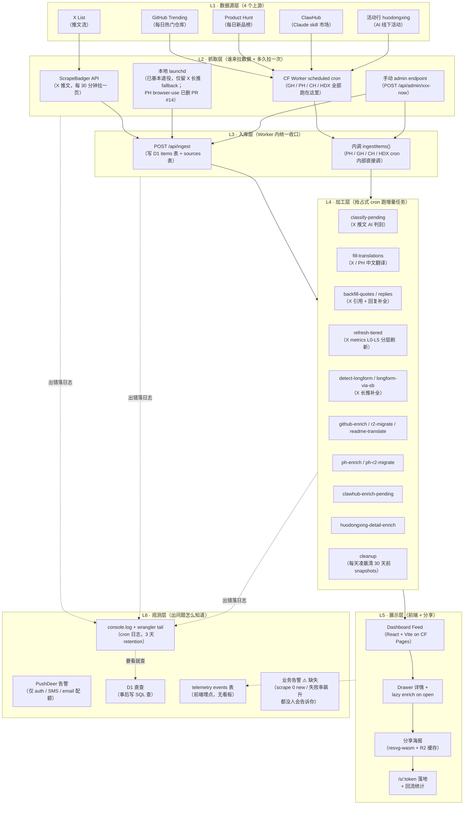
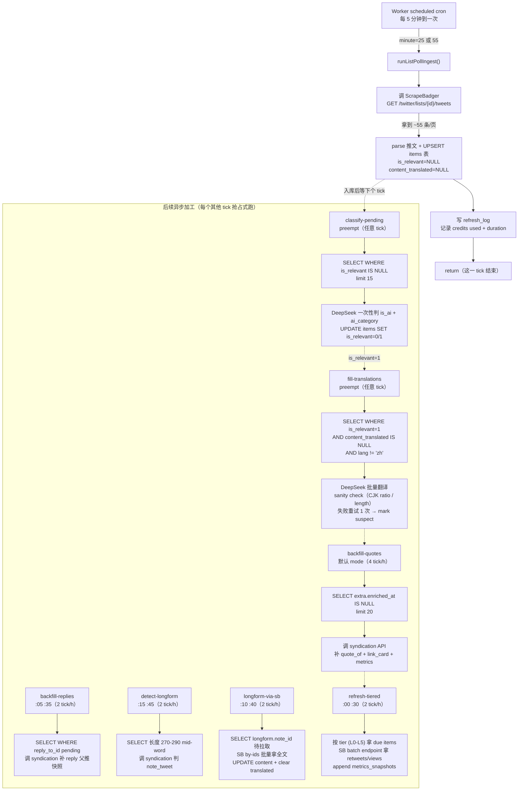
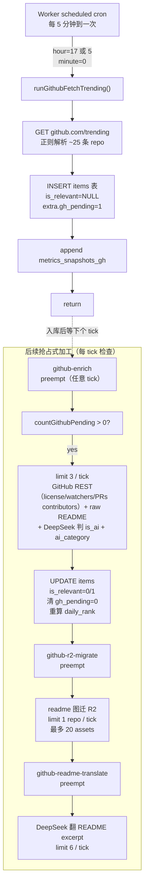
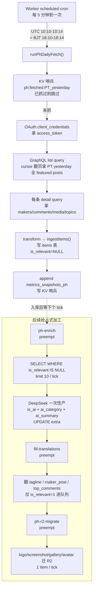
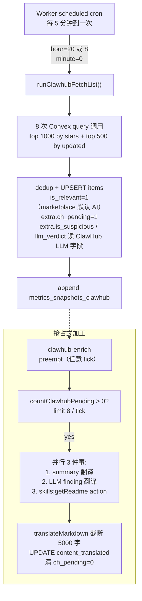
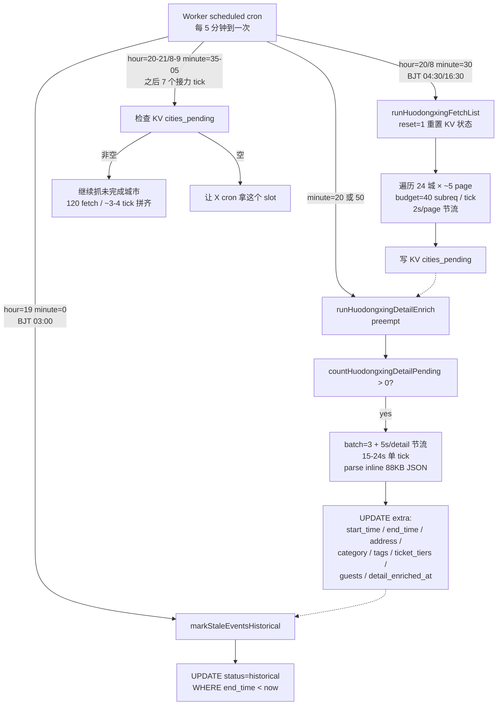

# aifeeds 抓取业务架构分层 + 端到端流程图

> **读这份文档之前**：你不需要写过一行代码，也不需要懂 Cloudflare。
> 每个英文词在第一次出现的地方会用括号简要解释。
> 目标是让任何人都能看出来：现在整个抓取流水线长啥样、哪里容易出问题、改哪里 ROI（投入产出比）最高。

---

## 📝 本文撰写后的状态变更（aifeeds-OPS session, 2026-05-14）

本文撰写时假设"PH 保留本地 launchd 跑 browser-use scraper"。后续 aifeeds-OPS session 走了相反方向 — PH 已彻底切到 worker cron + 本地 scraper 已删。下面是本文撰写后实际落地的变化（正文中相关描述已就地更新，留这一段做总览）：

| 变化 | PR | 说明 |
|---|---|---|
| ✅ PH 本地 scraper 彻底删除 | #14 | `scrapers/ph/` + `launchd/com.aifeeds.ph-scraper.plist` git rm；归档文档 `docs/archive/ph-scraper-retired.md`（含 git history pointer commit `1210ae8` 可恢复） |
| ✅ PH lazy-enrich-on-drawer 上线 | #12 | 用户打开 PH 抽屉时主动调 PH GraphQL by-slug 拿最新 votes/comments/maker_post，写回 D1 + append snapshot。X / GH / CH / **PH** 4 源都接入 `/api/items/:id/refresh` |
| ✅ D1 自动备份 worker 上线 | #16 | 独立 worker `aifeeds-d1-backup`（不混进 `xlist-api`）+ CF Workflows + R2 bucket `aifeeds-d1-backups`，每天 BJT 12:30 cron 自动 dump，30 天 lifecycle 滚动。月成本 $0（Workers Paid 含量内）。设计 `docs/plans/2026-05-14-d1-backup-workflows-design.md`，运维 operations.md §9 |
| ⛔ PH reviews 列表补全 | #18 | 实测 PH GraphQL Post **不暴露 reviews 字段**（只有 reviewsCount / reviewsRating 数字摘要）。老 scraper 的 `extra.top_reviews` 是 DOM 抠的，GraphQL 没对应 endpoint。决议接受现状（DOM scrape ROI 低且跟 PR #14 决策矛盾） |
| ⛔ PH comments 作者 mask 不可解 | #20 | 实测 OAuth user-token 拿到的 makers / comments[].user 也是 `[REDACTED]` / `id=0`，**跟 client_credentials 1:1 一致**。PH 全局隐私策略 mask，跟 token 类型无关。OAuth 实施方案彻底废弃 |

---

## 名词速查（一次性铺垫）

| 名词 | 一句话解释 |
|---|---|
| **Cloudflare（CF）** | 一家国外云服务商，aifeeds 的网站、后端、数据库都跑在他们家。 |
| **Worker** | CF 提供的「轻量级后端运行环境」。你写一段 JS / TS 代码丢上去，CF 会让它在全球边缘节点跑。aifeeds 的后端 `xlist-api` 就是一个 Worker。 |
| **cron** | 「定时任务」的统称。比如「每 5 分钟跑一次」就是一个 cron 任务。 |
| **scheduled cron**（Worker 自带的） | Worker 内置的定时器，CF 自己按你设的时间表去触发你的代码。 |
| **launchd** | macOS 自带的「定时任务管家」，相当于 Mac 上的 cron。aifeeds 的本地脚本就靠它定时跑。 |
| **D1** | CF 提供的 SQLite 数据库。aifeeds 所有抓回来的内容都存在 D1 里。 |
| **R2** | CF 提供的对象存储（类似 AWS S3）。aifeeds 用它存图片 / 视频 / 字体 / 海报缓存。 |
| **KV** | CF 提供的键值缓存（类似 Redis）。aifeeds 用它做去重哨兵、限流计数。 |
| **Pages** | CF 提供的静态网站托管。前端 dashboard 就是 Pages。 |
| **ingest** | 字面意思「摄入」，aifeeds 里指「抓到的数据写进 D1」这一步。 |
| **enrich** | 字面意思「丰富化」，指「数据进库后，再后台跑流程补全更多字段」。比如翻译、补元数据、判 AI 相关。 |
| **抢占式 cron**（worker 用的术语） | 同一个定时任务到点了，先看哪个队列有积压，有就先干那个，没有再干默认任务。 |
| **DeepSeek** | 一个国内的大模型 API，aifeeds 用它做翻译 + AI 相关性判别。 |
| **ScrapeBadger（SB）** | 一个第三方的 X / Twitter 抓取 API。aifeeds 走它的接口拿推文。 |
| **PushDeer** | 一个轻量的告警推送工具，往作者的 iPhone / Mac 发通知。aifeeds 风控 / 配额告警用它。 |
| **Convex** | 一个 BaaS（后端即服务），ClawHub 自己用 Convex 当数据库。aifeeds 直接打 Convex 的开放接口拿 ClawHub 数据。 |

---

## 1. 当前架构分层图

整套抓取业务可以拆成 **6 层**，从「数据从哪来」一直到「问题怎么暴露给人」：



### 1.1 各层落地清单

#### L1 · 数据源层（5 个上游）

> 注：CLAUDE.md 写的是「4 个数据源」，但代码里活动行 huodongxing 已经在 worker 里跑（2026-05-13 上线），实际 5 个，本文按代码实际为准。

| 源 | 真身 | 协议 | 实际频率 | 量级 |
|---|---|---|---|---|
| X List | ScrapeBadger `GET /twitter/lists/{id}/tweets` | REST + cursor 分页 | 30 分钟 1 次（`:25` / `:55`） | ~261 条/天 |
| GitHub Trending | `github.com/trending` HTML + GitHub REST API | HTML 解析 + REST | 每天 2 次（BJT 01:00 / 13:00） | ~25 条/次，新增 ~1-3 条/天 |
| Product Hunt | PH GraphQL API v2（OAuth client_credentials） | GraphQL | 每天 1 次（BJT 18:10） | ~30-50 条/天 |
| ClawHub | Convex 公开接口 `wry-manatee-359.convex.cloud` | HTTP query / action | 每天 2 次（BJT 04:00 / 16:00） | top 1500 条 dedup |
| 活动行 huodongxing | `huodongxing.com/events?tag=AI&city=...` SSR HTML | HTML 解析 | 每天 2 次（BJT 04:30 / 16:30），状态机接力 7 个 tick | ~150 新活动/天 × 24 城 |

#### L2 · 抓取层

| 执行体 | 跑在哪 | 触发周期 | 失败兜底 |
|---|---|---|---|
| Worker scheduled cron `*/5 * * * *` | CF 边缘节点 | 每 5 分钟 1 次 | console.error + 下一 tick 重试；**没有 PushDeer 告警**。 |
| `runListPollIngest`（X 拉新推） | Worker 内 | `:25` / `:55` 两个 slot | 单次失败 → 下次 cron 重试。SB 调用失败只 log。 |
| `runGithubFetchTrending` | Worker 内 | BJT 01:00 / 13:00 | 同上 |
| `runPhDailyFetch` | Worker 内 | BJT 18:10-18:14 5min 窗口 + KV 哨兵防重复 | 当日 KV 哨兵命中即跳过；不重试当天遗漏。 |
| `runClawhubFetchList` | Worker 内 | BJT 04:00 / 16:00 | 同上 |
| `runHuodongxingFetchList` | Worker 内 | BJT 04:30 / 16:30 起跑，之后 7 个 tick 接力 | KV 状态机记录 `cities_pending`；某城失败下一 tick 继续。 |
| ~~`com.aifeeds.ph-scraper` launchd~~ | ~~用户 Mac 本地~~ | — | **已彻底删除（PR #14, 2026-05-14）**。生产 PH 全云端 GraphQL；如需人工 fallback 见 `docs/archive/ph-scraper-retired.md` 用 `git checkout 1210ae8 -- scrapers/ph/ launchd/com.aifeeds.ph-scraper.plist` 恢复。 |
| `enrich_longform.py` launchd | 用户 Mac 本地 | 按需手动跑 | 处理历史截断推文 backlog；新 X 推走 SB 拿全文。 |
| 手动 admin endpoint | 任意机器 curl | 按需 | `POST /api/admin/ph-fetch-now` / `hdx-fetch-now` / `enrich/run?mode=xxx` |

#### L3 · 入库层

所有数据最终都落进 D1 `items` 表（统一 schema）。两条入库路径：

| 路径 | 怎么进 D1 | 用在哪 |
|---|---|---|
| `POST /api/ingest`（带 `INGEST_TOKEN` Bearer） | HTTP 接口，UPSERT 逻辑（同 `source_type+source_id` 重复时合并 extra JSON） | 长推回填脚本、手动数据迁移、未来外部 push 用（本地 launchd PH 已删，见上） |
| 内调 `ingestItems()` 函数 | Worker 内部直接调（不绕 HTTP） | GH / PH / CH / HDX cron 抓完直接写 |

**items 表统一 schema + extra JSON 各源专属字段对照**：

```
items
├─ id              composite，如 x_list:1234... / github:owner/repo / product_hunt:slug
├─ source_type     x_list | github | product_hunt | clawhub | huodongxing
├─ source_id       源内部 ID（推文 ID / repo full_name / slug）
├─ title           标题
├─ content         正文（X 是推文文本，GH 是 readme excerpt，PH 是 tagline 等）
├─ content_translated  中文译文（DeepSeek 补）
├─ author / handle 作者
├─ created_at      原内容发布时间
├─ scraped_at      入库时间
├─ media (JSON)    附件（图 / 视频 / gallery）
├─ metrics (JSON)  互动数据（X likes/retweets/replies/views；GH stars/forks 等）
├─ lang            原始语言
├─ is_relevant     0/1/NULL（AI 相关性，NULL 待判别）
├─ translated      0/1
├─ tier / next_refresh_at / last_velocity / deleted_at  ← M3 metrics 分层用
├─ translation_quality / translation_attempts            ← 翻译质量 sanity check
└─ extra (JSON)    源专属字段（见下）
```

**extra JSON 各源专属字段**：

| 源 | extra 关键字段 |
|---|---|
| **x_list** | `quote_of` 引用推快照 / `link_card` 链接预览卡 / `hashtags` / `thread_root_id` / `reply_to_id` / `enriched_at` / `longform` |
| **github** | `daily_rank` / `readme_excerpt` / `readme_translated` / `contributors_inline` / `license_spdx` / `default_branch` / `r2_migrated_at` / `ai_category` / `ai_summary` / `gh_pending` |
| **product_hunt** | `product_slug` / `launch_date_pt` / `daily_rank` / `topics` / `makers` / `hunter` / `maker_post` / `maker_post_translated` / `top_comments[]` / `ai_summary` / `ai_category` / `r2_migrated_at` |
| **clawhub** | `slug` / `latest_version` / `category` / `license` / `install` / `capability_tags` / `is_suspicious` / `llm_verdict` / `llm_analysis` / `readme_file` / `files_manifest` / `ch_pending` |
| **huodongxing** | `city / district / is_online / time_raw / first_seen_at / status / organizer / start_time / end_time / address / category / tags / is_free / ticket_tiers / guests / detail_enriched_at` |

时间序列指标分表（避免污染 items）：

- `metrics_snapshots`（X，每次 refresh 时 append）
- `metrics_snapshots_gh`
- `metrics_snapshots_clawhub`
- `metrics_snapshots_ph`（PH daily fetch 时 append）

#### L4 · 加工层

> Worker 的 `scheduled()` 每 5 分钟到一次，**先按 minute 算出默认 mode，再按"队列优先级"做 preempt（抢占）**。
> 一句话：哪个队列有积压就先干哪个，没积压才跑默认 mode。

抢占顺序（每 tick 上从上到下查）：

```
1. Huodongxing fetch / enrich / sweep（特定 hour/minute）
2. PH daily fetch（UTC 10:10-10:14）
3. List poll ingest（X 抓新推，minute=25/55，提到 preempt 之前）
4. Github enrich pending（有积压抢占）
5. Github r2-migrate pending（同上）
6. Github readme-translate pending（同上）
7. PH enrich pending（同上）
8. X classify-pending（同上，每 tick）
9. fill-translations pending（X + PH，每 tick）
10. ClawHub enrich pending（同上）
11. PH r2-migrate pending（同上）
12. 落到默认 mode（refresh-metrics / detect-longform / longform-via-sb / backfill-replies / backfill-quotes / cleanup）
```

#### L5 · 展示层

- Dashboard SPA（React + Vite）部署在 CF Pages，按 `source_type` chip 切换源
- 点开卡片打开 Drawer，**lazy enrich on drawer open**：调 `POST /api/items/:id/refresh` 主动刷该条 metrics + 翻译
- 分享按钮 → `POST /api/share/create` 生成 token + 海报 → `GET /api/share/poster/:token` 渲染 PNG（resvg-wasm + Noto SC 子集 + R2 缓存）
- 接收方扫码 → `/s/:token` 302 跳详情页 + 记 to_did / landed_at 做回流统计

#### L6 · 观测层

| 工具 | 覆盖范围 | 留多久 | 局限 |
|---|---|---|---|
| **PushDeer 告警** | 仅 auth/sms/email **配额**告警（额度 80% / 95% / kill / 风控命中） | 实时 | 业务 cron 完全无告警 |
| **console.log + `wrangler tail`** | 所有 cron 输出 + handler 异常 | 3 天 | 要事后人工看，无聚合 |
| **D1 直查** | 全部历史数据都能查 | 永久（除非 cleanup） | 要写 SQL；NULL 字段比例、失败率得手算 |
| **telemetry events 表** | 前端用户行为埋点 | 30 天计划中 | 无看板，只能 SQL |
| **Workers Logs**（CF Dashboard） | 已发布但 wrangler.toml **未 enable**（observability 节缺失） | 0 天 | 现状没启用 |

---

## 2. 抓取业务端到端流程图（每个源单独画）

### 2.1 X List 流水线



**每个环节的失败兜底 + 监控点 + 死角**：

| 环节 | cron 频率 | 失败重试 | 监控点 | ⚠️ 死角 |
|---|---|---|---|---|
| list-poll-ingest | 30 分钟 1 次 | 下次 cron 重试；无次数上限 | console.log 写 `tweets_seen` | **持续 0 new 没告警**（2026-05-13 就因 preempt hijack 30h 没抓到，得用户发现） |
| classify-pending | 每 tick 抢占 | 失败的 item is_relevant 仍 NULL，下次 tick 再来 | console.log batch 大小 | **DeepSeek 持续失败没告警**；item 卡 NULL 用户看不到 |
| fill-translations | 每 tick 抢占 | DeepSeek 失败 → translation_attempts +1，sanity 不过 → mark suspect | translation_quality 字段 | **suspect 翻译没人筛**；mark 完没下文 |
| backfill-quotes | 4 tick/h | enriched_at 设了就不再重跑（含空结果） | console.log mode result | **syndication 不返 quote 时 silent 跳过**；用户没引用上下文 |
| backfill-replies | 2 tick/h | 同上 | 同上 | 同上 |
| detect-longform | 2 tick/h | 候选标了 note_id 等下游拉 | console.log 命中率 | 标了 note_id 但 longform-via-sb 没消费 = 用户看截断版 |
| longform-via-sb | 2 tick/h | SB 失败 → attempts+1 / 3 次后放弃 | refresh_log | **3 次重试后死了没告警**；item 永远残缺 |
| refresh-tiered | 2 tick/h | metrics 字段保留旧值 | refresh_log (tier / subreq) | **L5 item 永远不刷新**（设计如此，无 push 来源时假数据） |

---

### 2.2 GitHub Trending 流水线



| 环节 | cron 频率 | 失败重试 | 监控点 | ⚠️ 死角 |
|---|---|---|---|---|
| github-fetch | 每天 2 次 | 失败 → 12h 后下次 cron 重试 | console.log items_seen | **trending HTML 改版没告警**；解析挂了 24h 才再试 |
| github-enrich | 每 tick 抢占 | 3 重试后放弃 | console.log mode result | **gh_pending 长期 > 0 没告警**（DeepSeek 挂 / GH API rate limit 都可能卡） |
| github-r2-migrate | 每 tick 抢占 | 失败仍标 migrated | 同上 | 静默失败 |
| github-readme-translate | 每 tick 抢占 | 同上 | 同上 | 同上 |

---

### 2.3 Product Hunt 流水线



| 环节 | cron 频率 | 失败重试 | 监控点 | ⚠️ 死角 |
|---|---|---|---|---|
| ph-daily-fetch | 每天 1 次 18:10 BJT | KV 哨兵 hash 当天 PT_date；同 PT_date 重试不重复抓 | console.log items + KV ph:fetched 哨兵 | **当天 18:10 那 5 min 窗口挂了 = 全天漏抓**（哨兵不知道是失败还是 OK，第二天才有下次机会） |
| ph-enrich | 每 tick 抢占 | 重试 → DeepSeek 失败 NULL 不变 | console.log | 同 GH，**enrich 队列长不告警** |
| ph-translate | 每 tick 抢占 | 同上 | 同上 | 同上 |
| ph-r2-migrate | 每 tick 抢占 | 失败标 migrated_at | 同上 | 静默失败；用户看到 broken image |

---

### 2.4 ClawHub 流水线



| 环节 | cron 频率 | 失败重试 | 监控点 | ⚠️ 死角 |
|---|---|---|---|---|
| clawhub-fetch | 每天 2 次 | 失败 → 12h 后下次 | console.log items_seen | **Convex 接口改了没告警**；翻车了次日才知道 |
| clawhub-enrich | 每 tick 抢占 | 失败 ch_pending 仍 1 | console.log | **ch_pending 长期 > 0 没告警**；ClawHub 改 schema 时翻车特别隐蔽（v0 → v2 改过两次） |

---

### 2.5 活动行 huodongxing 流水线（最复杂的状态机）



| 环节 | cron 频率 | 失败重试 | 监控点 | ⚠️ 死角 |
|---|---|---|---|---|
| hdx-fetch-list | 每天 2 起跑 + 接力 | KV 状态机自带；某城失败下次接着抓 | console.log + GET /api/admin/hdx-status | **WAF 风控触发**（detail 15/min 持续 4 分钟）只在日志里见，无告警 |
| hdx-detail-enrich | 每 tick 抢占 minute=20/50 | 失败下次再来 | 同上 | 同上 |
| hdx-sweep | 每天 1 次 | 失败 → 24h 后 | 同上 | 漏过期不影响展示，但 status 字段会脏 |

---

## 3. 现状问题清单

### 3.1 「记录抓了但详情页数据没更新」的根因分析

**问题描述**（来自 TODO #5）：feed 里看到一条 item，但点开 drawer 发现 metrics、quote、翻译都是老数据 / 半残数据。

**架构上失效的层次**：**L4 加工层**。

**4 类失效场景**：

| 场景 | 触发条件 | 当前是否有机制覆盖 | 覆盖效果 |
|---|---|---|---|
| **A · metrics 显示老数据** | item 太老（L5 tier）→ refresh-tiered 不再主动刷 | 部分覆盖：drawer 打开调 `/api/items/:id/refresh` 主动 refresh | ✅ 但仅当用户点开才触发；feed 卡片显示的还是老数据 |
| **B · 翻译缺失** | DeepSeek 持续失败 → translation_attempts 不超过 3 → 标 suspect 不抛弃 | fill-translations 每 tick 抢占重试；但 suspect 只标不处理 | ⚠️ 长尾失败永远缺翻译 |
| **C · quote / link_card 缺失** | enriched_at 设了即跳过；syndication 不返 quote 时 silent 跳过 | backfill-quotes cron 每 4 tick 1 次 | ⚠️ 第一次没拿到的永远拿不到（哨兵已设） |
| **D · 长推内容被截断** | detect-longform 标了 note_id 但 longform-via-sb 没消费（队列卡）；或 3 次重试后放弃 | longform-via-sb cron 2 tick/h | ⚠️ 3 次失败后悄悄放弃 |

**TODO #0 / #5 的相关 stub 状态**：

- TODO #0 提到 `worker/src/enrich.ts:242` 的 `product_hunt: 留到下次 PR` —— **PH lazy-enrich-on-drawer 还没接**。打开 PH item drawer 不会触发 refresh。
- TODO #5 提到「前端曝光触发」、「字段补全扫描」、「分享海报触发」、「失败死信队列」**全部没做**。

**核心症结**：所有加工任务都是「队列驱动 + silent fail」。**没有任何机制告诉你「某条 item 反复 enrich 失败」或「某个字段全表覆盖率掉下来了」**。

### 3.2 业务级告警缺失点（按严重程度）

| 缺失场景 | 严重程度 | 当前用户怎么发现 | 应该怎么知道 |
|---|---|---|---|
| **X scrape 持续 0 new 多轮** | 🔴 高 | 用户刷新 feed 没新内容时投诉 | refresh_log 连续 N 轮 tweets_seen=0 → PushDeer |
| **PH 当天 18:10 窗口挂了 → 全天漏抓** | 🔴 高 | 第二天发现 feed 缺日榜 | KV 哨兵没设 = 失败信号；19:00 没设就告警 |
| **GH trending 解析改版挂了** | 🟡 中 | 几天后发现没新 repo | items_seen 连续两天 < 3 → 告警 |
| **DeepSeek 持续失败率飙升** | 🟡 中 | 翻译失败 / classify 失败堆积 | 每 tick 失败计数 / 总计数 > 阈值 → 告警 |
| **某条 item 反复 enrich 失败** | 🟡 中 | 用户报特定卡片缺数据 | translation_attempts ≥ 3 / longform attempts ≥ 3 累计计数 → 告警 |
| **metrics 字段覆盖率跌破阈值** | 🟢 低 | 不会发现，全表 SQL 才能查 | 每日定时跑覆盖率扫描 → 阈值告警 |
| **CF Worker subrequest 配额接近上限** | 🟡 中 | CF 给账单 + 服务降级 | 接 Workers Logs `invocation_logs.duration_ms` 异常 |
| **D1 写入持续失败** | 🔴 高 | 直接看不见新数据 | 接入 Workers Logs + 错误率告警 |
| **R2 资源 broken**（图片 404） | 🟢 低 | 用户看到 broken image | telemetry image_load_error 已经在采，但**没看板没告警** |
| **某 cron mode 连续 N 次 0 处理** | 🟡 中 | 队列堆积时间长 | clawhub-pending / gh-pending 等队列长度 → 阈值告警 |

**对照现状**：PushDeer 告警**仅覆盖 SMS / Email 配额 + 风控命中**。**所有内容抓取链 0 告警**。

### 3.3 可观测性盲区（只能事后查 D1）

| 盲区 | 当前唯一查法 | 影响 |
|---|---|---|
| 每条 item 的 lifecycle trace（fetch → classify → translate → enrich → save） | 反推字段（is_relevant / content_translated / extra.enriched_at 等是否为空） | 排查「为啥这条卡了」要写多个 SQL |
| 单次 cron tick 的执行明细 | `wrangler tail` 实时 + console.log（3 天 retention） | 24h 后的事故只能从字段反推 |
| DeepSeek 调用成本 / token 消耗 / 失败率 | 无（直接打 DeepSeek API） | 不知道月费会冲到多少 |
| ScrapeBadger credit 用量 | refresh_log 表有 credits_used 但没看板 | 月底才会知道用了多少 |
| 每个源每日入库量趋势 | 写 SQL `SELECT count(*) GROUP BY source_type, date(scraped_at)` | 没有时间序列图，看不出趋势 |
| 每个 enrich queue 当前积压数 | 每个源都有自己的 countXxxPending() helper，但不暴露 | 不查 SQL 不知道有积压 |
| 「item 反复 enrich 失败」的统计 | `extra.longform.attempts >= 3` 这种字段才能查 | 无聚合视图 |
| 翻译 sanity check suspect 总量 | `SELECT count(*) WHERE translation_quality='suspect'` | 标了就标了，没下文 |
| **业务关键 funnel**（PV → drawer open → share → register） | events 表 SQL 自查 | 无看板（TODO #7 计划做） |

### 3.4 国内访问性能瓶颈点理论分析（不实测，只列可能性）

> 提醒：以下未做实测，是基于公开知识 + 项目当前架构推理的「可能瓶颈清单」，按概率 + 影响排序。

#### A · CF 国内节点路径（最大可能性）

- **CF 国内中转策略**：CF 没有大陆境内 PoP（国内访问要绕到香港 / 日本 / 韩国 / 洛杉矶节点），晚高峰（北京 20:00-23:00）跨境出口拥塞时延迟可飙到 200-800ms。
- **DNS 查询本身可能慢**：国内 ISP DNS 解析 cloudflare 域名经过国际线路。
- **首字节延迟（TTFB）**：Worker cold start + 跨境延迟叠加，国内首屏 TTFB 可能 500-1500ms。
- **缓解措施现状**：已有 `/img` 反代（绕 GFW 抓 twimg），但 dashboard / API 主路径无加速。

#### B · SPA 首屏 chunk 加载

- **React + Vite + Tailwind 默认产物**：单 chunk 可能 200-400KB（gzip），首屏需要全 parse 才出内容。
- **没有 SSR / prerender**：TODO #12 P0 节明确写「SPA 没 SSR 抓到的是空壳」—— 这不只是 SEO 问题，也是首屏性能问题。
- **Code splitting 现状**：vite 默认按 dynamic import 切，但项目源码里大部分组件 eager import。

#### C · 字体（已部分解决）

- HarmonyOS Sans SC 自托管在 `fonts.ai-feeds.com` R2 子域，cn-font-split 子集化 ≈ 200KB 单页加载。
- **国内 R2 仍走 CF 边缘**：跟主路径一样要绕。
- **没有 font-display: swap 兜底**：字体没到位时白屏。

#### D · 图片格式

- 当前所有图（头像 / 截图 / 海报）都走 R2 原始格式 + worker `/r/<key>` 反代。
- **未启用 cdn-cgi/image transform**（TODO #4 阶段 2 计划做）—— 没自动 webp/avif 转换，移动端浪费流量。

#### E · API cold start

- CF Worker 全球分布，cold start 通常 <50ms，但 `nodejs_compat` flag 开了可能略慢。
- 第一个请求多打 `/api/items` + `/api/sources` + `/api/stats` 三个接口，无 batch。

#### F · 微信内浏览器（TBS）兼容性

- TBS 通常 Chrome 86-90，Vite 8 默认 target Chrome 111+，可能需要 polyfill。
- 微信 webview fetch 不稳定，apiFetch 已加 5s × 3 重试。

#### G · 国内 GFW 干扰

- 已踩过：pbs.twimg.com 图被封 → 上 `/img` 反代解决。
- 其他白名单外资源（YouTube embed / 部分 npm CDN）仍可能间歇 broken。

---

## 4. 改造建议（按 ROI 排序）

### 4.1 TODO #4 CF 迁移 5 阶段能直接覆盖的（不用额外开 TODO）

| 现状问题 | 覆盖阶段 | 覆盖方式 |
|---|---|---|
| 业务 cron 错误率无告警 | 阶段 1 | Workers Logs 启用后 CF Dashboard 直接看 stacktrace + 错误率 |
| DeepSeek 调用成本不可见 | 阶段 1 | AI Gateway 接入后单接口可看 token / cost / cache 命中 |
| 国内图片流量浪费 | 阶段 2 | Images cdn-cgi 改造，webp/avif 自动转 + width 参数 |
| cron mode 多 + 状态分散 + 单 step 失败无 retry | 阶段 3-4 | Workflow 接入后端到端 trace 可见、step retry 自动、状态自管 |
| longform / metrics 字段补全失败死信 | 阶段 4 | Workflow 内每 step retry 配置 + 死信自动告警 |
| D1 备份缺 | 阶段 5 | Container 跑 D1 export → R2 长期存档 |
| 视频抽帧（海报封面）| 阶段 5 | Container 跑 ffmpeg |
| 来源分析（referer / 设备 / 国家） | 阶段 1 | Web Analytics 启用 |

### 4.2 #4 没覆盖的（需要独立新增 TODO）

| 问题 | 建议新增 TODO | 紧迫度 |
|---|---|---|
| **业务级告警（scrape 0 new / 翻译失败率 / metrics 覆盖率）** | 独立 TODO「业务级 PushDeer 告警分级」 | 🔴 P0 高 |
| **PH 当天 18:10 漏抓没告警** | 同上 | 🔴 P0 |
| **suspect 翻译堆积无人处理** | 独立 TODO「翻译 suspect 审核面板」（可并入 TODO #8.B 关键词审核） | 🟡 P1 |
| **每个源 enrich queue 长度可视化** | 可以放进 TODO #7 admin analytics | 🟡 P1 |
| **国内访问性能基线测试** | 独立 TODO「国内 RUM 性能监测」 | 🟡 P1 |
| **CN 镜像站 .cc SSR** | TODO #12 已有 | 🟡 P1 |

### 4.3 优先级总排序（建议 4 周内做的）

1. **本周（零成本快赢）** —— TODO #4 阶段 1 全开：Web Analytics + Workers Logs + AI Gateway
2. **本周** —— 加业务级 PushDeer 告警（最小集：scrape 0 new + PH 漏抓 + 各 queue 长度阈值）
3. **下周** —— TODO #4 阶段 2 Images cdn-cgi
4. **2-3 周** —— TODO #4 阶段 3 GH Workflow 试点（学习曲线 + 验证）
5. **3-4 周** —— TODO #4 阶段 4 X 主链 Workflow 迁移

---

## 5. 跨源统一性评估

### 5.1 5 个源对照表

| 维度 | X List | GitHub | Product Hunt | ClawHub | huodongxing |
|---|---|---|---|---|---|
| **抓取频率** | 30 min | 12 h | 24 h | 12 h | 12 h + 接力 tick |
| **抓取方式** | SB API | trending HTML + REST | GraphQL | Convex query | SSR HTML |
| **AI 判别** | 必做（噪音多） | 必做 | 必做 | 跳过（默认 is_relevant=1） | 暂无（marketplace 性质） |
| **metrics 刷新** | tiered L0-L5 | 入库时一次性 + drawer lazy | 入库时一次性 | 入库时 + drawer lazy | 入库时一次性 |
| **R2 资源迁移** | 仅图片代理 `/img` | readme 图片迁 R2 | logo/screenshot/avatar 全迁 | 无 | 暂无 |
| **错误日志** | console.log + refresh_log | console.log | console.log | console.log | console.log |
| **失败告警** | ❌ | ❌ | ❌ | ❌ | ❌ |
| **死信队列** | longform attempts 字段 | 无（gh_pending 一直 1） | 无（is_relevant NULL 一直挂） | 无（ch_pending 一直 1） | 无 |
| **enrich pending count helper** | 多个内联 SQL | countGithubPending | 内联 SQL | countClawhubPending | countHuodongxingDetailPending |
| **drawer lazy refresh** | ✅ | ✅ | ⚠️ stub（TODO #0） | ✅ | ❌ |
| **海报变体** | renderXContent | renderGithubContent | renderPhContent | renderClawhubContent | ❌ 缺 |
| **chip 颜色** | 白 | mint | peach | lavender | 待定 |

### 5.2 不一致 + 建议

#### 应该统一的

| 维度 | 建议统一为 |
|---|---|
| **pending 队列 count helper** | 全部叫 `count<Src>Pending(env)` 单一接口，统一 SQL 模式 |
| **错误日志格式** | 结构化 JSON：`{ source, mode, items, errors, duration_ms }`，方便 Workers Logs 过滤 |
| **失败告警阈值** | 全源统一 PushDeer 告警 schema：`<src> <mode> <metric> over threshold` |
| **drawer lazy refresh** | 5 源全接 `/api/items/:id/refresh` 路径，把 PH stub + HDX 补上 |
| **海报变体** | huodongxing 补上 `renderHdxContent` |
| **死信队列** | 5 源全用统一字段 `extra.<mode>.attempts >= 3` 触发死信 |
| **enrich queue 暴露给 admin** | 加 `GET /api/admin/queues` 一次性返回 5 源各 mode 当前积压数 |

#### 可以保留特殊性的

| 维度 | 为什么保留 |
|---|---|
| **metrics 刷新策略** | X 互动数据高频变化（病毒推 1h 涨 10k 赞），值得 tiered；GH/PH/CH 周期长，入库时一次 + drawer lazy 即可 |
| **抓取频率** | 内容产生速率不同；X 流式 vs GH/PH 每日榜单 vs HDX 接力状态机各有道理 |
| **AI 判别** | ClawHub / HDX 是优选 marketplace，跳过 LLM 判别合理 |
| **R2 迁移策略** | X 推文图量大且 twimg 不易挂，反代足够；PH/GH 个体重要、URL 易失，迁 R2 |
| **抓取协议** | API / HTML / GraphQL / SSR 各有原因，不强求统一 |

---

## 6. 一句话总结

**如果只能做一件事让这套系统健壮一个档次：把 TODO #4 阶段 1（Workers Logs + Web Analytics + AI Gateway） + 业务级 PushDeer 告警（scrape 0 new / PH 18:10 漏抓 / 各 queue 长度 / DeepSeek 失败率）一起在本周做掉。**

理由：

1. **零业务代码改动**，只动 `wrangler.toml` 4 行 + 加几个 fetch 包装 + 加 PushDeer 调用，2-3 小时工作量。
2. **解决最大盲区**——从「事故了才知道」变成「事故了 5 分钟内知道」，所有后续优化（Workflow 迁移、性能改造、镜像站）都站在「能看到正在发生什么」的基础上。
3. **不依赖任何拍板决策**——不用等 ICP 备案、不用等设计、不用挑厂商。
4. **后续所有架构演进的前置条件**——没有可观测性就是闭眼飞行；先把仪表盘装上再讨论换发动机（Workflow 替代 cron）。

> 排在第二位的是 TODO #4 阶段 2（Images cdn-cgi 改造），半天工时带来移动端流量 60-80% 节省。
> 排在第三位的才是 Workflow 迁移（结构性优化，但学习曲线 + 双写期 2-3 周）。

---

## 附录：建议立刻补的 4 类告警 minimum viable set

```
1. scrape 0-new 连续 ≥ 3 轮（每源独立）
   → check: list-poll-ingest / gh-fetch / ph-fetch / clawhub-fetch / hdx-fetch 都加

2. PH 日窗口未触发
   → check: 每天 BJT 19:00 看 KV ph:fetched:<PT_yesterday> 是否存在；不存在 → PushDeer

3. enrich queue 持续积压 > 阈值
   → check: countGithubPending / countClawhubPending / countHuodongxingDetailPending /
            classify-pending count / fill-translations count 各 > N 持续 M tick → 告警

4. DeepSeek 调用失败率 > 5%（滚动 1h 窗口）
   → 实现：每次调 DeepSeek 在 KV 累加 success / failure 计数，每 tick 检查比率
```

这套补完后 80% 的「我怎么不知道这都坏了」事故能在 5-15 分钟内主动告警。
